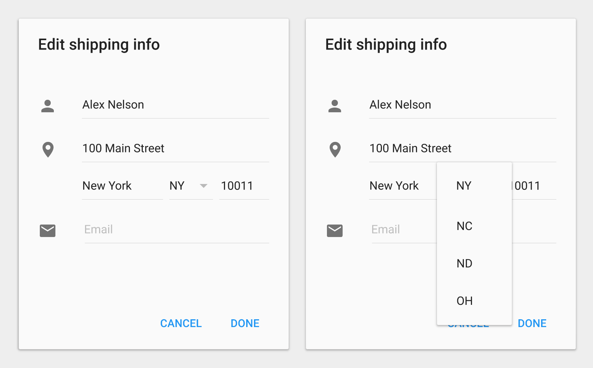
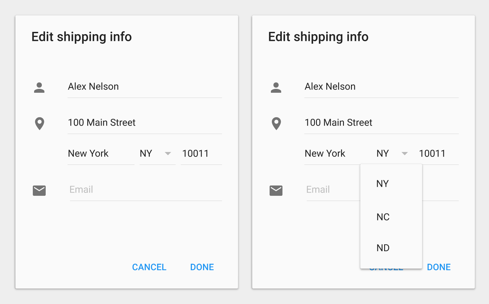

# 菜單

Menus allow users to take an action by selecting from a list of choices revealed upon opening a temporary, new sheet of material.

## 使用

菜單是一種從一個按鈕，一個動作，或者包含至少兩個菜單控制項，所觸發時出現暫時性的一張紙。

每個菜單項目是一個零散的選項或者動作，而這可能會影響到應用程式，檢視或者被選擇的元素中的呈現。

菜單不應該在應用程式上被用作一個頁面導航上的主要功能。

觸發按鈕的文字或者控制項的標籤，準確的反映出包含菜單裡的菜單項目。菜單列通常使用單字作為標籤，例如“文件”，“格式”，“編輯”，“檢視”，而其它情況下可能會有更詳細的標籤文字。

菜單是顯示一組相近菜單項目，其中每一個可以被啟用或者應用程式上當前狀態應該被禁止。

> Do.

> Don't

根據應用程式的當前狀態上下文菜單動態改變其現有的和已啟用菜單項。 

一般情況下，不放一些與當前上下文無關的內容的菜單項目，而且在一定條件滿足下不啟用菜單的項目是對功能有相關的。（例如：複製功能是當文字被選擇時會被起用的）

某些應用程式的狀態，可能會導致一個只包含菜單項的上下文菜單。例如：在網頁上凸顯文字，Android 只是複製功能，使用者不能剪下或貼上文字。

在靠近螢幕邊緣上，菜單的垂直與水平需要重新定位。

如果菜單的高度阻擋了所有菜單項目的顯示。那麼菜單可以使用內部的滾動方式。舉一個例子是，在橫向的手機顯示上檢視菜單時。

菜單也可以是層疊的

這些動作會顯示滾動以及層疊菜單。

<video width="760" height="570" controls="">
<source src="//material-design.storage.googleapis.com/publish/v_2/material_ext_publish/0B08MbvYZK1iNb3hiNjFBTUU4V0k/components-menus-menus-appbar_dropdown_spec_large_xhdpi.webm" type="video/webm">
<source src="//material-design.storage.googleapis.com/publish/v_2/material_ext_publish/0B08MbvYZK1iNd2s3WE1CRkN5aU0/components-menus-menus-appbar_dropdown_spec_large_xhdpi.mp4" type="video/mp4">
</video>

> 下拉式 

<video width="360" height="402" controls="">
<source src="//material-design.storage.googleapis.com/publish/v_2/material_ext_publish/0B0NGgBg38lWWX2VYY3Vnd1J2cTQ/components-menus-usage-061001_Textfield_Dropdown_xhdpi_003.webm" type="video/webm">
<source src="//material-design.storage.googleapis.com/publish/v_2/material_ext_publish/0B0NGgBg38lWWcF9Ndmt1RTZoWk0/components-menus-usage-061001_Textfield_Dropdown_xhdpi_003.mp4" type="video/mp4">
</video>

> Textfield drop down

<video width="360" height="640" controls="">
<source src="//material-design.storage.googleapis.com/publish/v_2/material_ext_publish/0B2wX4iIvu8L6YVh1eDYzUTdLNVU/components-menus-usage-061001_Appbar_Dropdown_xhdpi_002.webm" type="video/webm">
<source src="//material-design.storage.googleapis.com/publish/v_2/material_ext_publish/0B2wX4iIvu8L6d3BWRGNFMEdWUnM/components-menus-usage-061001_Appbar_Dropdown_xhdpi_002.mp4" type="video/mp4">
</video>

> App bar drop down

<video width="760" height="570" controls="">
<source src="//material-design.storage.googleapis.com/publish/v_2/material_ext_publish/0B08MbvYZK1iNaDNNa01QX2x4UkU/components-menus-menus-cascading_dropdown_spec_large_xhdpi.webm" type="video/webm">
<source src="//material-design.storage.googleapis.com/publish/v_2/material_ext_publish/0B08MbvYZK1iNWVBad29DaVJrREk/components-menus-menus-cascading_dropdown_spec_large_xhdpi.mp4" type="video/mp4">
</video>

> 層疊下拉式

## 菜單項目

每個菜單項目都限制在一個本文內，說明這個動作將在被選擇時會被執行。

本文通常是一個單字或者很短的語句，不過它可以包含圖示以及幫助本文。例如鍵盤的快捷鍵，和控制項。就像是複選方塊來表示多個項目或狀態。請詳見 [控制項列表](components-listcontrols.html).

靜態內容的菜單應該放在菜單上方作為最常用的項目。

動態內容的菜單包含可能有其他行為，例如：以前在菜單上選擇字體時，會根據使用者動作而改變。

菜單項目可以顯示巢狀式的子菜單。試著限制使用一層的巢狀式的方式，因為它會讓多重嵌入的巢狀式子菜單變得更難以控制。

當顯示動作為禁止時，而不是要將它們移除，需要讓使用者知道必須在適當的情況下，這些被禁止的動作才能啟用。

例如：重做的功能是當這個動作不需要再重做時，此時這個按鈕是被禁止的。剪下以及複製是在內容被選擇的時候才會出現的功能。

---

## 行為

菜單顯示上述所有其他在應用程式的 UI 元素。

菜單的消失，可以透過點選菜單以外的區域，或者在觸發按鈕上點選。

一般的情況下，選擇一個菜單項目也會將菜單消失。當菜單允許多個項目選擇的時候，這時將是屬於例外情形。例如：使用複選方塊控制項。

菜單被定位在觸發的元素上面，使得當前選擇菜單顯示在觸發元素的上方。

不要顯示一個重複的菜單項目

> 好的做法.
>
> Do not display a duplicate of the selected menu item.

> 不好的做法.
>
> Positioning the menu below the emitting element separates it from its context.

> Don't.

## Simple Menus

Simple menus are used in list views on tablet and mobile devices to display the options for a specific list item.

**Disambiguation**: In contrast to [simple menus](http://www.google.com/design/spec/components/dialogs.html#dialogs-simple-dialogs), simple dialogs can present additional detail related to the options available for a list item or provide navigational or orthogonal actions related to the primary task. Although they can display the same content, simple menus are preferred over simple dialogs because simple menus are less disruptive to the user’s current context.

Use simple menus in lists to display the options for a specific list item.

Choosing an option immediately commits the option and closes the menu.

Touching outside of the menu, or pressing Back, cancels the action and closes the menu

When opened, simple menus attempt to vertically align the currently selected menu item with the list item.

When close to a screen edge, simple menus reposition their vertical alignment so that all menu items are completely visible.

> Do.
>
> Do not arbitrarily position the first menu item over the list item

> Don't.

Simple menus appear over their emitting element, not below.

> Do

> Don't.

Menu width varies depending on string length.

Simple menus always maintain a 16dp margin (phone) or 24dp margin (tablet) to the left and right edges of the screen.

Menus show a persistent scroll bar when content is scrollable.

> Do.
>
> Display a scroll bar by default for scrollable content.

> Don't.
>
> Without a scroll bar, it’s unclear there are additional menu items available.

Don’t duplicate the selected menu item.

> Do.

> Don't
>
> Don’t display a duplicate of the selected element.

Simple menus are always aligned with the start of the list item text and do not reposition horizontally based on touch location.

> Do.
>
> Simple menus are left-aligned regardless of touch location.

> Don't.
>
> Simple menus do not reposition based on touch location.

## 指標

Metrics are provided for various sizes and types of menus and for different platforms.

### 行動

### 各種寬度

### 層疊菜單

### 層疊紅線

---

*翻譯：[Weiju](http://weijutu.blogspot.tw/)*