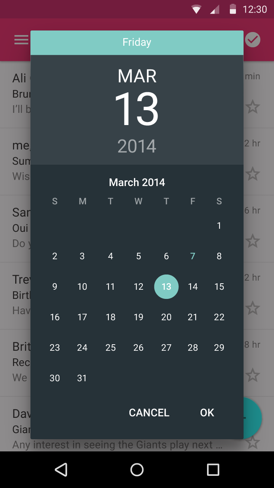
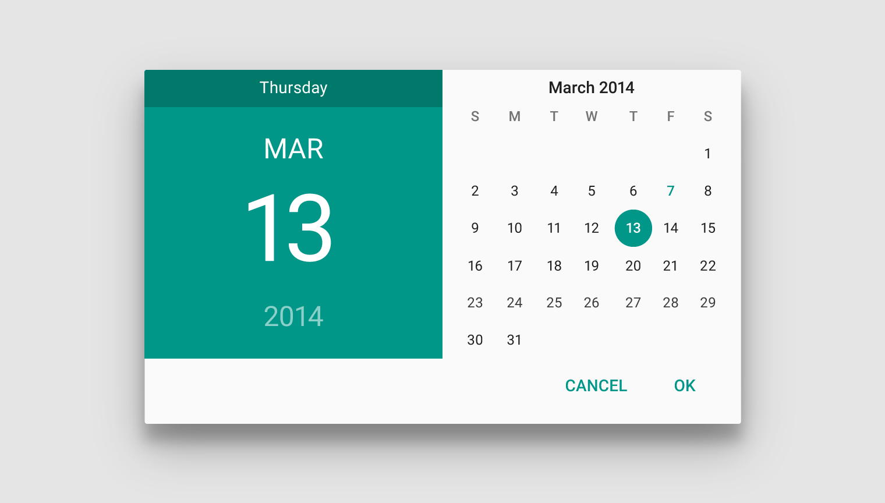
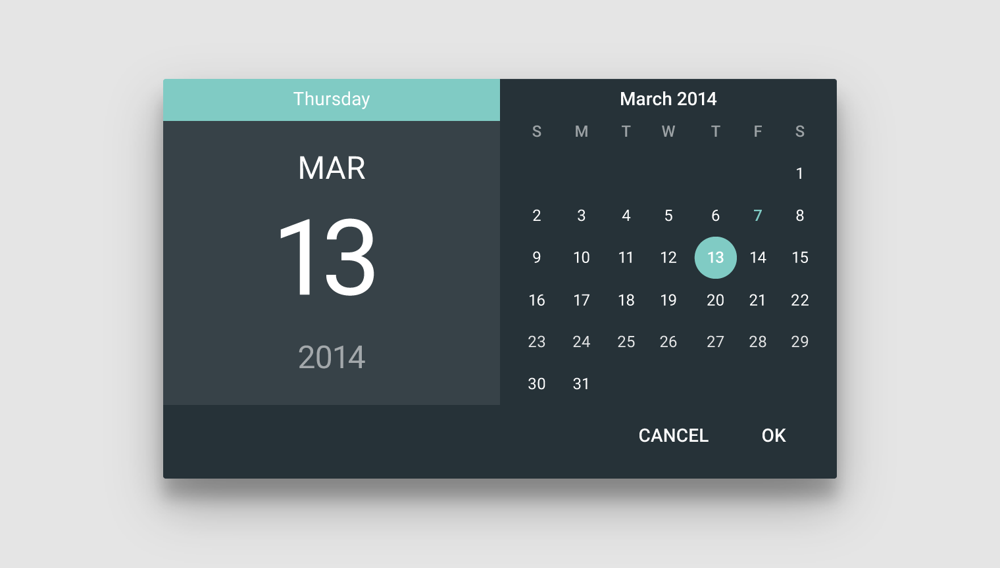
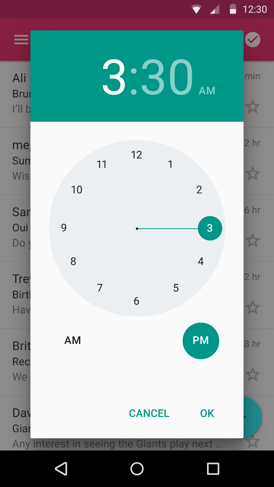
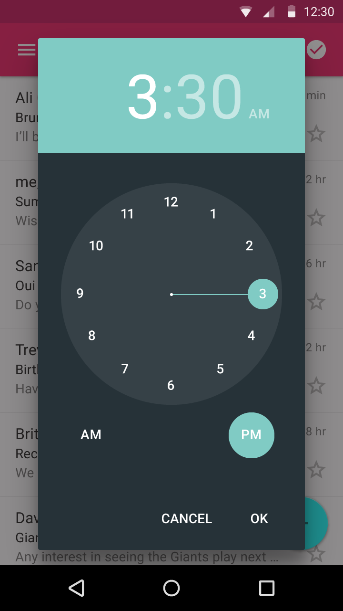

# Pickers

Pickers provide a simple way to select a single value from a set. Ready-to-use date and time pickers are included.

Each picker is a dialog with a set of controls for entering the parts of the date (month, day, year) or time (hour, minute, AM/PM). Using these in your app helps ensure that a user's specification of a date or time input is valid and formatted correctly. The format of a time and date picker adjusts automatically to the locale, i.e. month-day-year in the US and day-month-year in other regions.

Pickers can be used inline on a form, but on mobile their relatively large footprint is best suited for display in a dialog. For inline display, consider using more compact controls such as text fields or dropdown menus.

### Date Picker

Light and Dark themes in portrait and landscape

> Date picker: Light theme, portrait

> Date picker: Light theme, landscape

> Date picker: Dark theme, landscape

### Time

Light and Dark themes in portrait and landscape

> Time picker: Light theme, portrait

> Time picker: Dark theme, portrait

> Time picker: Light theme, landscape

> Time picker: Dark theme, landscape

