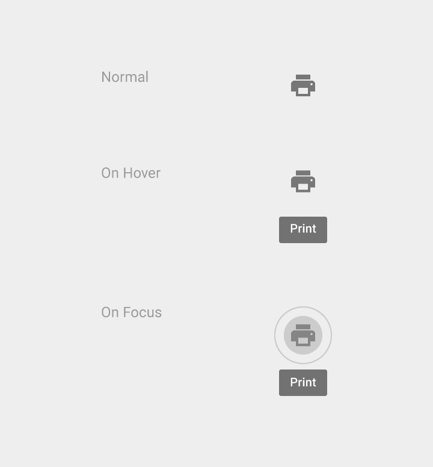
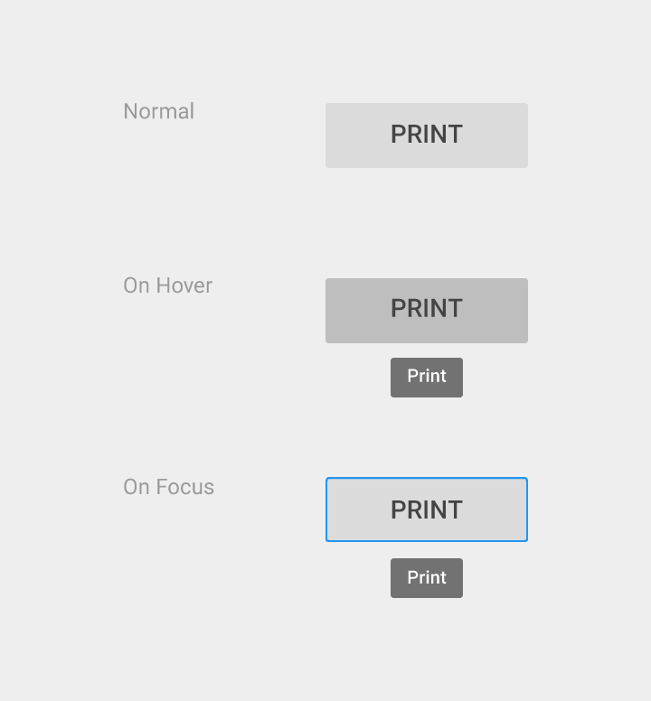
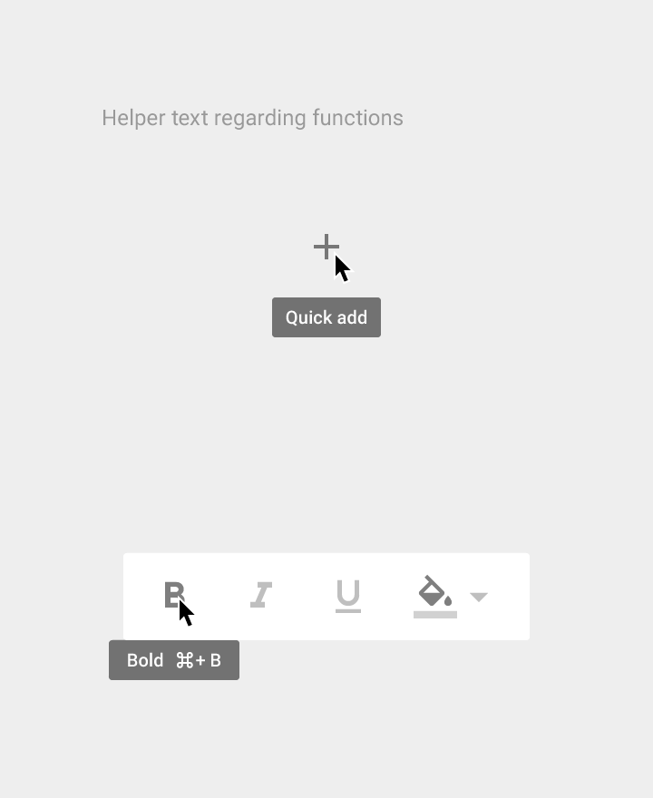
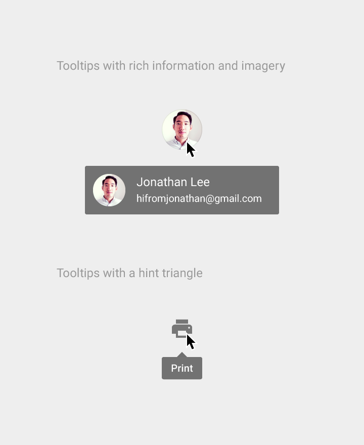
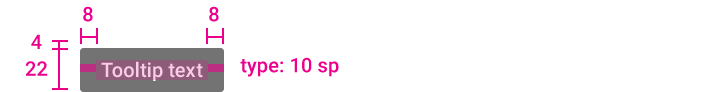
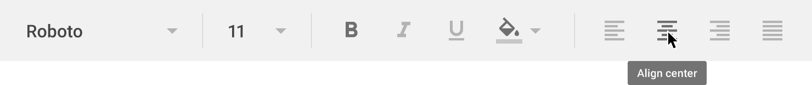
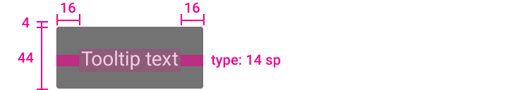
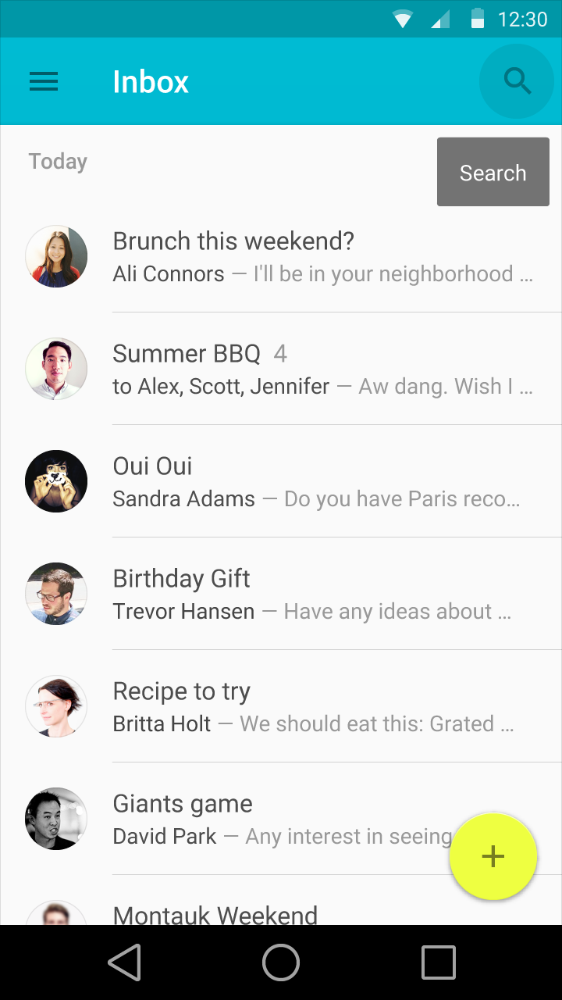
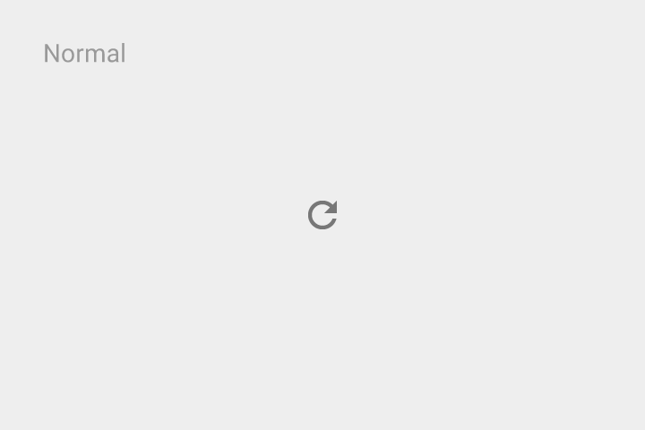
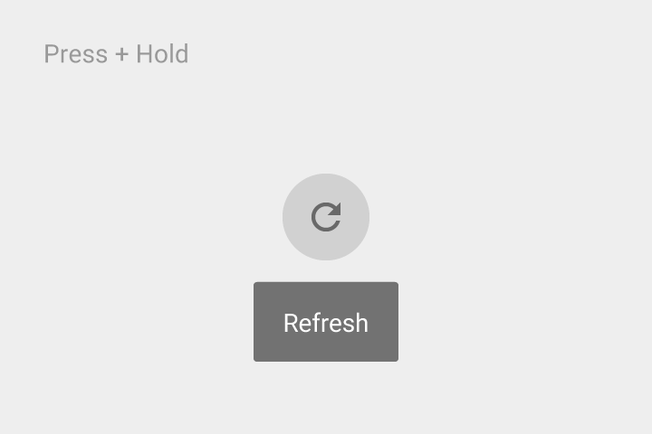

# Tooltips

## Usage

Use tooltips for elements that are 1) interactive and 2) primarily graphical (not textual).

> Do.

> Don't.

Tooltips are different then hovercards, which display richer information including images and formatted text.

Tooltips are different than ALT-attributes, which are intended primarily for static images.

> Do.

> Don't.

## Cursor/keyboard Tooltips

Text: Roboto Medium 10 sp

Background fill: 90% opaque

## Tooltip motion

<video  width="360" height="384" controls="">
<source src="//material-design.storage.googleapis.com/videos/components-tooltips-cursorkeyboardtooltips-tooltips_005_large_xhdpi.webm" type="video/webm">
<source src="//material-design.storage.googleapis.com/videos/components-tooltips-cursorkeyboardtooltips-tooltips_005_large_xhdpi.mp4" type="video/mp4">
</video>

## Touch UI Tooltips

### Touch UI Tooltips

Text is Roboto Medium 14 sp

Background fill is 90% opaque

