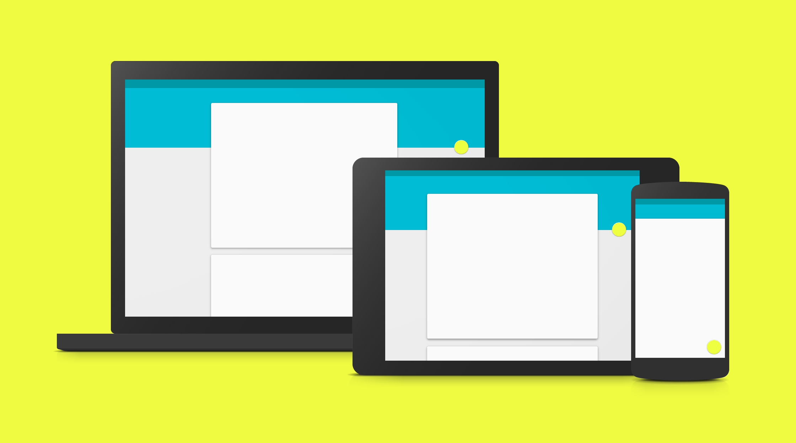
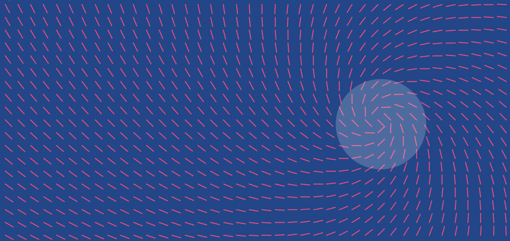
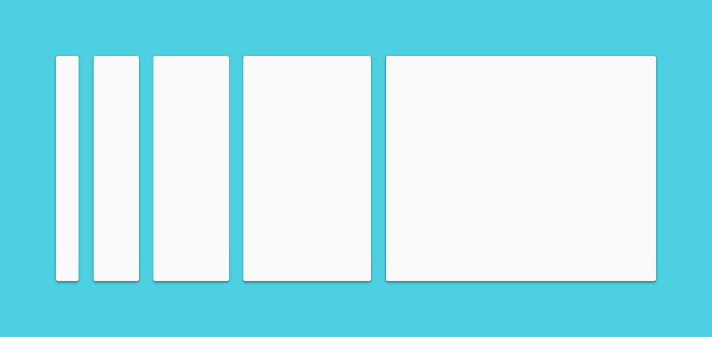
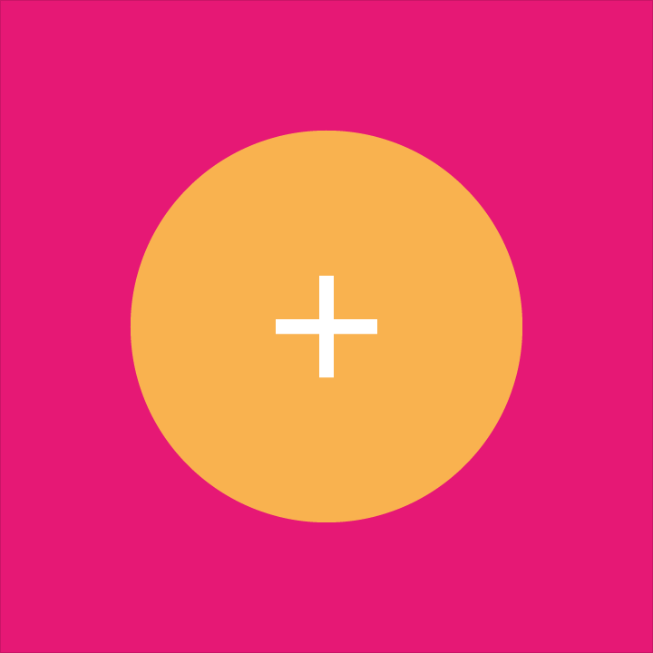

# 介紹

我們挑戰自己，為我們的用戶創造一種視覺語言，遵循創新技術和科學的可能性，
組合出良好設計的經典原則。這就是Material Design。這個規範是一個及時更動的文件，
我們將陸續開發、更新更多質感設計的原則和細節。
 

## 目標

創造一種視覺語言，遵循創新技術和科學的可能性，
組合出良好設計的經典原則。

開發一個單一的基礎系統，允許跨平台裝置和設備大小，並統一使用者的體驗。
行動裝置的限制是基本的，但觸摸，聲音，鼠標和鍵盤都是優異的輸入方式。

----

## 原則

> 質感隱喻

質感隱喻是針對合理的空間以及系統的運作訂定出的統一理論。質感是現實感官的質地、感受，
這個靈感來自於紙張和油墨的研究，而技術的先進，開啟了想像力延伸和魔法般的構思。 

表面和邊緣的質感提供了現實中的感官做為視覺線索。使用熟悉的觸覺特性可以幫助用戶快速了解其中暗示。
然而該質感的延展性創造了新的啟發，取代在物理世界中原有的那些，而不會破壞​​物理學的規則。 

基本的光、外觀和運行是如何傳達物件移動的關鍵，存在空間與交互作用彼此相互關聯，
逼真的照明能夠顯示接縫，劃分空間，並說明了移動部件。

> 大膽、圖形、動機

印刷中基礎設計裡的基本元素 - 排版、網格、空間、尺度、色彩，和用圖像引導的視覺處理，
這些元素做的遠不止討好眼睛，他們創造的層次結構、意義和重點、精心的色彩選擇，
邊緣連接邊緣的圖像，大規模的排版，以及故意空白打造出大膽的圖形界面，讓用戶沉浸在使用者體驗。 

> 動畫提供意義

動畫方面加強了用戶使用就像原動機，基本用戶的操作是改變所有設計的一個啟發點。

所有動作在一個環境裡都需要使用一些空間，以不中斷的用戶體驗傳送物件給用戶就像他們自己改變與重組一樣。

動畫是有意義的和適當的，有利於集中注意力，並保持連續性。反饋是微妙而清晰。過渡動畫是高效而且連貫。

----

> *翻譯： Tillonter*