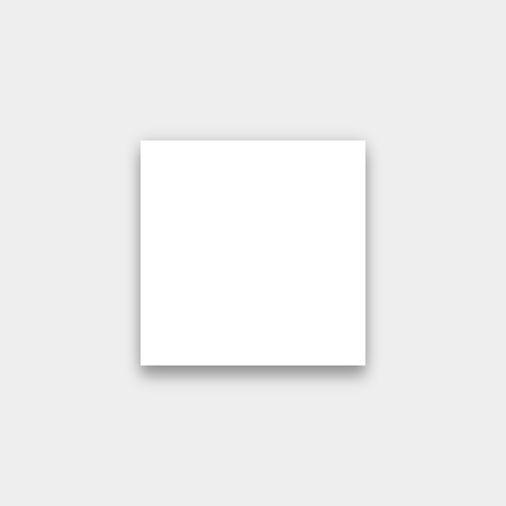

# 環境

**內容**

>[3D的世界](#3dworld)
>
>[光源與陰影](#ligntandshadow)

##<h2 id='3dworld'>3D的世界</h2>

Material所存在的環境是一個3D空間，這表示所有物件都有x、y和z維度。z軸是與畫面所在的平面垂直的，正的z軸值表示向視聽者的方面延伸。每一個material表單在z軸上佔據一個位置並且有一個標準的1dp厚度。

---

##<h2 id='ligntandshadow'>光源與陰影</h2>

在Material環境中，虛擬的光源照明整個場景並且使得物件可以投射陰影。一個主要的光源創造了直接的陰影，而另一個環境光源從各個角度創造一致的，柔和的陰影。

所有在material環境中的陰影都是由這兩個光源所投射。陰影是因為在z軸上的個個不同位置的material表單吸收了這些光源後所造成的。

