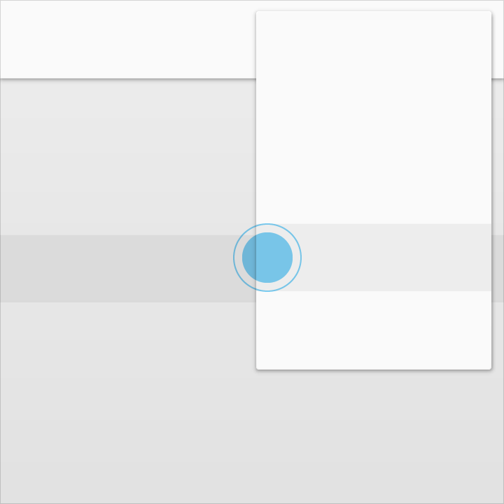
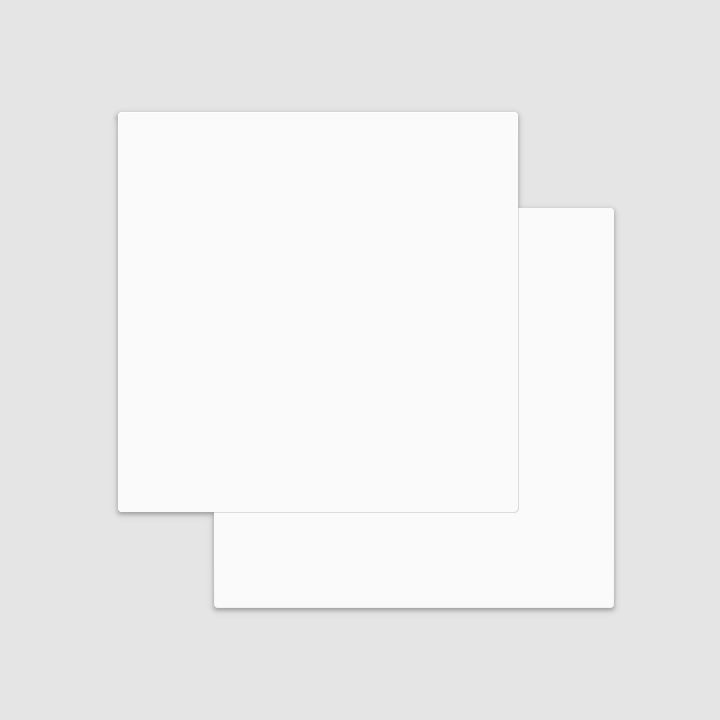
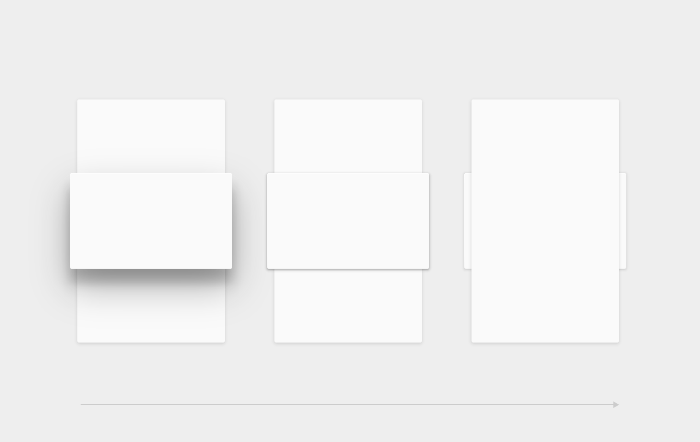

# Material特性

**內容**

>[物理特性](#physicalproperties)
>
>[Material的變形](#transformingmaterial)
>
>[Material的動作](#movementofmaterial)

##<h2 id='physicalproperties'>物理特性</h2>

Material有兩個不同的維度x與y（以dps為單位）和一個統一的厚度（1dp）。Material絕對不會有厚度為0的情況。

Do.
Material的寬與高可以不同

Don't.
Material永遠都是1dp厚

Material會投射陰影。

陰影是因為material元素間在z軸上的不同高度自然產生的。

<video id="whatismaterial-materialprop-physicalprop" crossorigin="anonymous" preload="" controls="">
<source src="https://material-design.storage.googleapis.com/publish/v_1/quantumexternal/0B0NGgBg38lWWSE9IaUpqYzlpSW8/whatismaterial-materialprop-physicalprop-020201_PaperShadow_Do_xhdpi_007.webm" type="video/webm">
<source src="https://material-design.storage.googleapis.com/publish/v_1/quantumexternal/0B0NGgBg38lWWRWJfTERvdnM1bGc/whatismaterial-materialprop-physicalprop-020201_PaperShadow_Do_xhdpi_007.mp4" type="video/mp4">
</video>

Do.
Material投射陰影

<video id="1-None_0B0NGgBg38lWWM0xqQms4LWRkMVE" crossorigin="anonymous" preload="" controls="">
<source src="//material-design.storage.googleapis.com/publish/v_1/quantumexternal/0B0NGgBg38lWWYU5lQ1VXQjA3NnM/whatismaterial-materialprop-physicalprop-020201_PaperShadow_Dont_xhdpi_007.webm" type="video/webm">
<source src="//material-design.storage.googleapis.com/publish/v_1/quantumexternal/0B0NGgBg38lWWM0xqQms4LWRkMVE/whatismaterial-materialprop-physicalprop-020201_PaperShadow_Dont_xhdpi_007.mp4" type="video/mp4">
</video>

Don't.
陰影大小永遠不會用material來做估計

內容以不同形狀與顏色顯示在material上。內容不會增加material的厚度。

<video id="1-None_0B0NGgBg38lWWSGQycHdwcTdyRk0" crossorigin="anonymous" preload="" controls="">
<source src="http://material-design.storage.googleapis.com/publish/v_1/quantumexternal/0B0NGgBg38lWWTG41Rk9fT19qUXc/whatismaterial-materialprop-physicalprop-020201_InkDisplay_xhdpi_005.webm" type="video/webm">
<source src="http://material-design.storage.googleapis.com/publish/v_1/quantumexternal/0B0NGgBg38lWWSGQycHdwcTdyRk0/whatismaterial-materialprop-physicalprop-020201_InkDisplay_xhdpi_005.mp4" type="video/mp4">
</video>

Do.
Material can display any shape and color.

內容的行為可以和material的行為分離。然而material的邊界可以限制內容的呈現範圍。

<video id="1-None_0B0NGgBg38lWWVzltT01CSHpaNXM" crossorigin="anonymous" preload="" controls="">
<source src="//material-design.storage.googleapis.com/publish/v_1/quantumexternal/0B0NGgBg38lWWeVBlbExGYjlTeEE/whatismaterial-materialprop-physicalprop-020201_InkBehavior_xhdpi_005.webm" type="video/webm">
<source src="//material-design.storage.googleapis.com/publish/v_1/quantumexternal/0B0NGgBg38lWWVzltT01CSHpaNXM/whatismaterial-materialprop-physicalprop-020201_InkBehavior_xhdpi_005.mp4" type="video/mp4">
</video>

Material是固體。

輸入的事件不會穿透material。

Do.

Don't.

多個material元素不能同時佔據空間上的同一點。

Do.

Don't.

Material不能穿透其他material。

舉例來說，一個material表單不能在變換高度時穿透另一個material表單。

Don't.

##<h2 id='transformingmaterial'>Material的變形</h2>

Material can change shape.

video

Material grows and shrinks along only its plane.

video

Material never bends or folds.

video

Sheets of material can join together to become a single sheet of material.

video

When split, material can heal. For example, if you remove a portion of material from a sheet of material, the sheet of material will become a whole sheet again.

video

##<h2 id='movementofmaterial'>Material的動作</h2>

Material can be spontaneously generated or destroyed anywhere in the environment.

video

Material can move along any axis.

video

Z-axis motion is typically a result of user interaction with material.

video
