# 錯誤

錯誤是當應用程式在完成預期結果時失敗的情況。錯誤發生於：

- 應用程式無法理解用戶所輸入。
- 系統或用硬程式失敗。
- 用戶企圖同時運行不符合的操作。

試著透過好的設計避免錯誤。讓您的應用程式理解用戶，而非讓用戶必須了解應用程式。當錯誤發生時，清楚地與用戶溝通發生什麼事並且如何快速解決它。儲存並且盡可能地保存狀態，尤其當用戶有輸入內容時。

如同所有的回饋，優先考慮最重要的訊息為何，透過內容狀態溝通以避免多餘的元素在畫面上，以及在畫面上的外觀形狀具有一致性(and be consistent with screen placements within and across form factors.)。

## 用戶輸入錯誤
提供用戶錯誤輸入的語境（上下文）以幫助用戶修正它們。盡可能快速地、客氣地讓用戶知道他們有錯誤需要修正。別讓他們提交一份冗長的表單時，才跟他們說他們犯了錯。當偵測到錯誤，便停用提交按鈕。當錯誤僅能在用戶提交表單後才被發現，要清楚什麼地方出錯，以及用戶該如何具體地修正它。

### 文字欄位輸入 

輔助信息將顯示在任何用戶與之互動的時間前、之中、後。錯誤信息不得出現在用戶尚未與該欄位互動前。輔助信息將轉換成錯誤信息當用戶輸入錯誤文字。

避免畫面上過多的信息，降低用戶（填表的）速度。並非每個文字欄位都需要輔助和（或）錯誤信息。

當文字欄位之下可放錯誤信息，文字欄位下方需有額外的內間距 16dps 作為錯誤信息的用途。

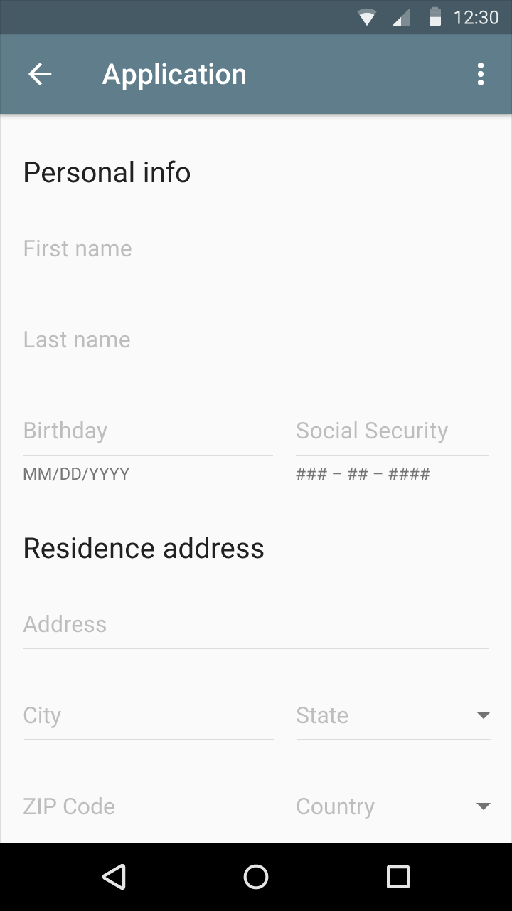

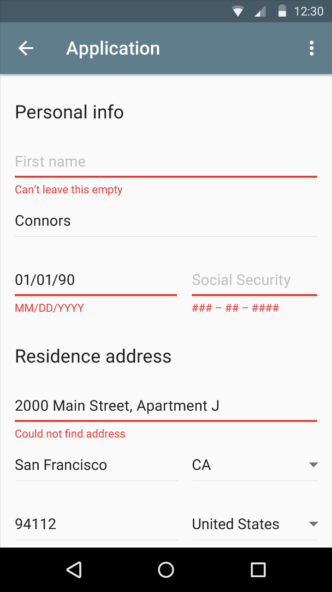

#### 亮版

- 錯誤信息的字型是 Roboto Regular 12sp
- 提示以及輔助信息是 #000000 和 38% alpha

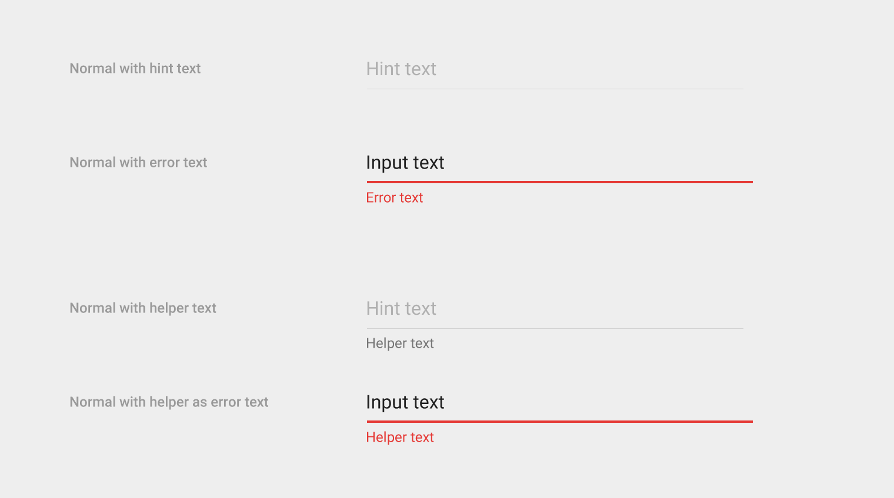

#### 暗版

錯誤信息的字型是 Roboto Regular 12sp
提示以及輔助信息是 #FFFFFF with 30% alpha

#### 輔助及錯誤信息

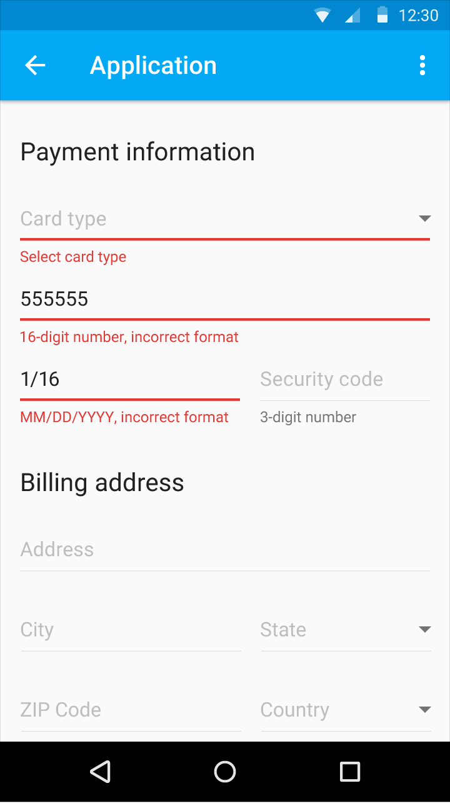

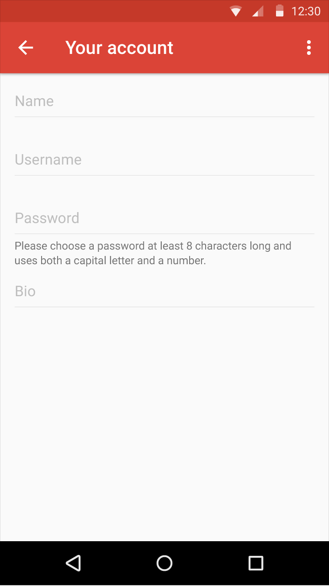

#### 錯誤與浮動文字標籤

#### 文字欄位輸入 - 字數以上／以下或字元計算

計字器可以在用戶與欄位互動之前、之中和之後顯示。考慮不顯示計字器直到用戶接近字數限制。計字欄位需額外的內間距 16dps 在它下方。

- 計字器字型是 Roboto Regular 12sp

#### 計字器於單行

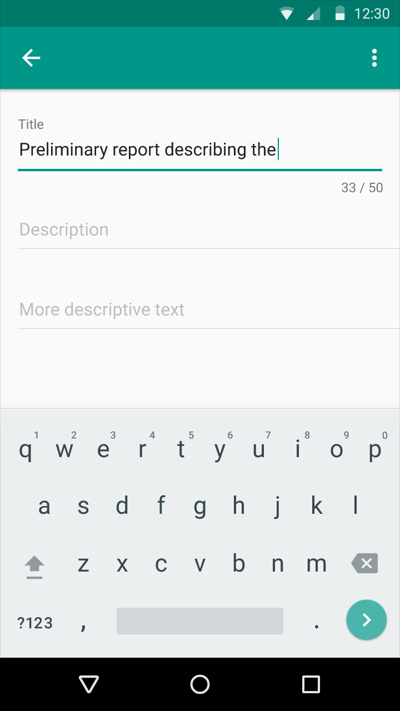

#### 計字器於多行

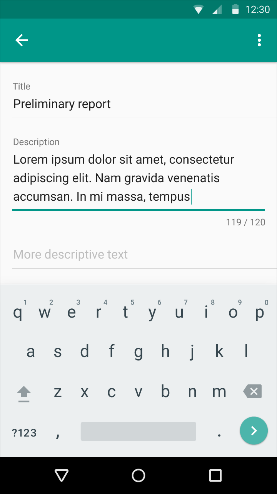

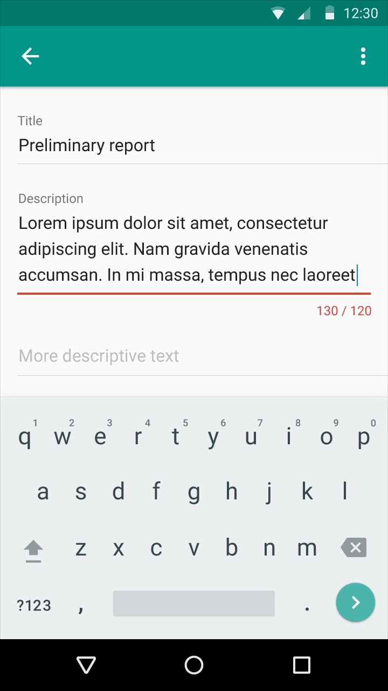

### 不符合值

不符合值的錯誤信息，將在用戶與欄位互動時或後被觸發。

當有兩個以上不符合值的輸入，在每個須修正的欄位應顯示文字欄位以及錯誤訊息。額外的訊息將加在表單或畫面上方，總括所需做的修正以及其他額外的說明。

#### 試圖提交表單後錯誤偵測

表單重載需滾到表單上方，統一錯誤信息的位置。單一欄位的錯誤信息將因用戶作用後解決。

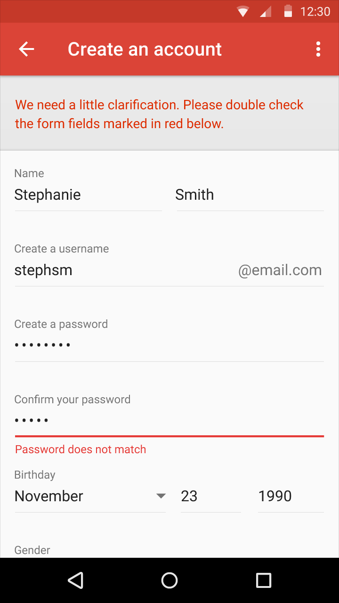

### 表單不完整

表單填寫不完整的錯誤需在用戶已經充分填寫過表單後，顯示被他們跳過的欄位。如果無法在用戶填寫表單時偵測，將於用戶試圖提交表單後顯示此錯誤。

當表單內的欄位被留白，則每一個文字欄位以及欄位下方的錯誤訊息需顯示錯誤。

#### 提交前表單內含有多個錯誤

當用戶填寫完表單，它足以單獨地標記錯誤訊息。

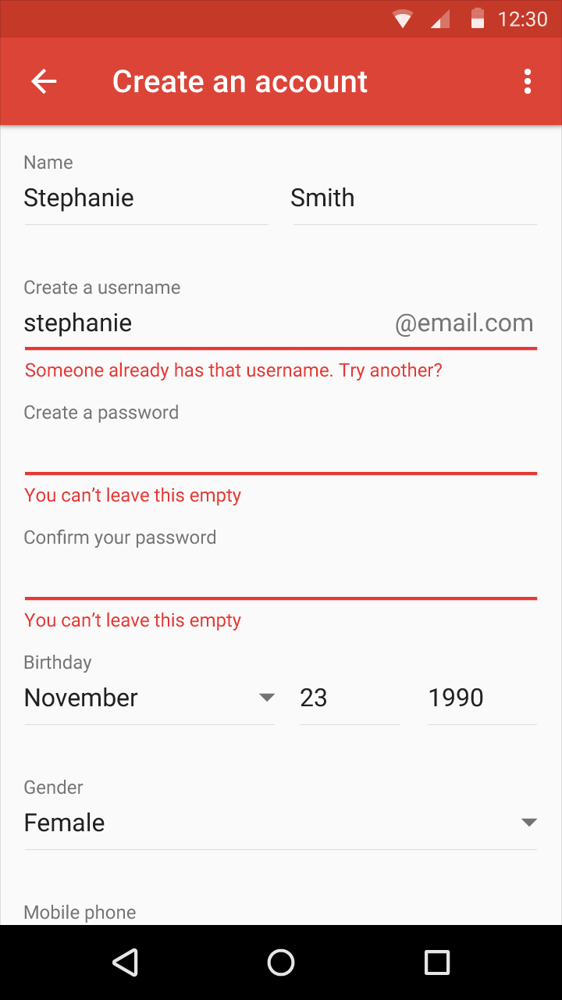

### 單行列錯誤

## 應用程式錯誤
應用程式錯誤發生於無關用戶輸入。

### 一般應用程式錯誤

當錯誤還在過程中，應用程式仍要顯示其作用／載入指示器，直到達到失敗狀態並顯示該應用程式錯誤。

如果功能不可用，可以在UI中表示。並非每個錯誤都需要彈出一個新組件。

盡可能給予您的用戶一個動作以幫助他們解決錯誤。別讓他們被錯誤困住。

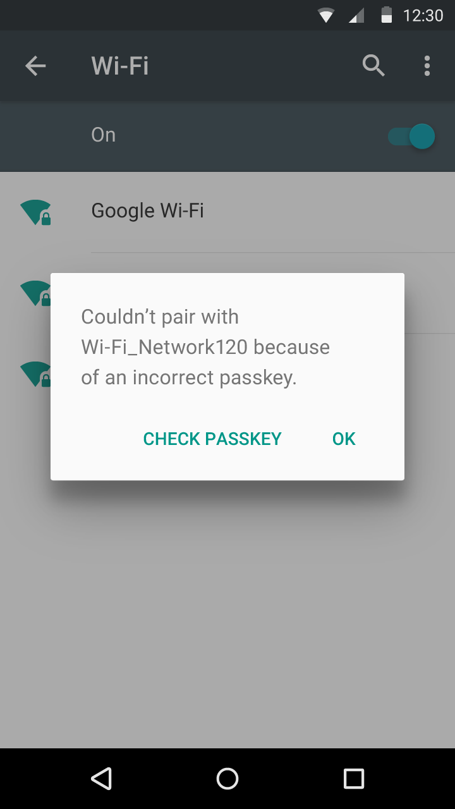

> 警告對話框：應用程式回饋關於阻止正常運作的錯誤。  

> Snackbar：應用程式回饋關於外部的錯誤。Snackbars是短暫的，避免用它們來顯示嚴重的、持續性地、大量的錯誤。

### 同步加載錯誤／失敗

設計一個應用程式的關鍵部分在於確定內容如何於畫面呈現。這邊的集合是每個畫面在它正常內容無法顯示時該如何做。 
範例包含：

- 畫面通常呈現一份項目清單，但尚無項目存在。
- 畫面通常顯示搜尋結果，但目前的搜尋不到任何結果。
- 畫面通常顯示雲端內容，但目前因未知錯誤而無法顯示。

這類型的狀況稱為空狀態。雖然他們並非常態，但將之設計好很重要。因為用戶可能對遇到非期望的事而感到失望。

當同步已經關閉或內容載入失敗，用戶應能與應用程式中尚能使用的最大部分做互動。

> 正在加載空狀態畫面／內容。

> 內容／組件操作的具體錯誤。

### 連線狀態

當斷線時，用戶應能與應用程式中尚能作用的最大部分做互動。

如果合適的話，顯示一個連結幫助用戶完成他們的任務。僅只提供確實可以支援的連結給他們。例如，不要提供一個像是「重試」的選項，如果您已經察覺到這個操作會失敗。

> 含有重試的 Snackbar

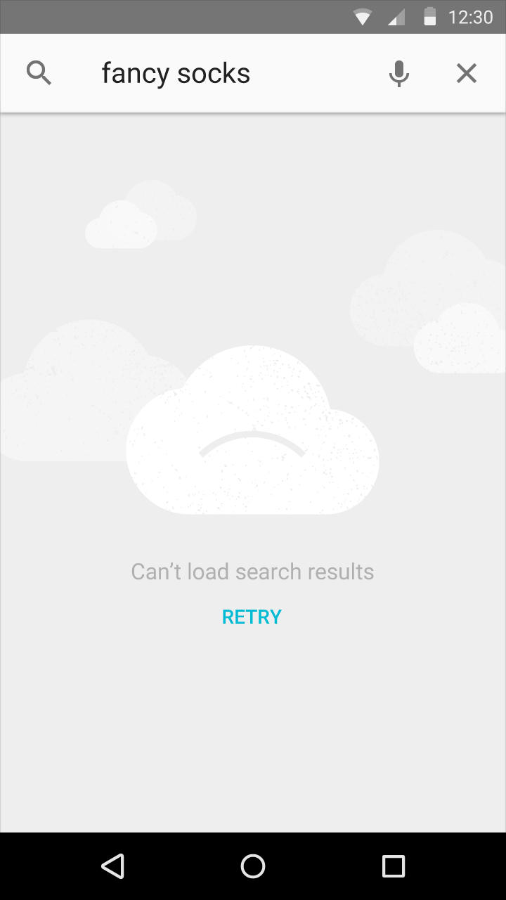

> 在畫面上的空狀態，僅可在連線時作用。

## 不符合的狀態錯誤

不符合的狀態錯誤發生於用戶試圖執行互相衝突的操作，例如在飛航模式播電話或在受限的帳號做截圖。透過清楚地傳達用戶所選的狀態以及他們來自其餘經驗的暗示，避免讓用戶自己陷入那個處境。 當這些錯誤被觸發，並不意味著這是用戶所犯的過失。

#### 一般不符合

清楚關於錯誤發生的原因以及產生的地方。  

範例：

- 在受限模式中，不允許使用截圖以及高級功能。

> Snackbar + Special mode indicator

#### 自行選擇離線

當用戶在這一個狀態時，考慮顯示一個不唐突但持續性的指示。

範例：

- 於飛航模式中撥打電話
- 離線時聽音樂的有效性

> Snackbar

> 裝置已轉為飛航模式的指示器。

### 權限請求

當您的應用程式在工作流程進行前需要用戶的授權，考慮讓權限要求成為應用程式流程的一部分，而非將它當作錯誤。

如果授權在第一次執行應用程式時是必要的，考慮如何使它適合應用程式的歡迎步驟。

範例：

- 一個應用程式的權限有所改變。
- 應用程式的內部加購功能已被禁用。

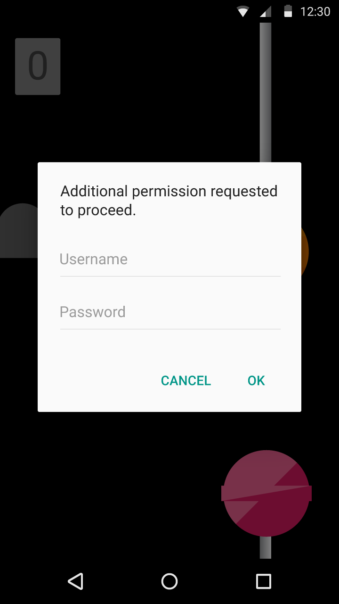

> 對話框

> *翻譯： Yi-Bei*
