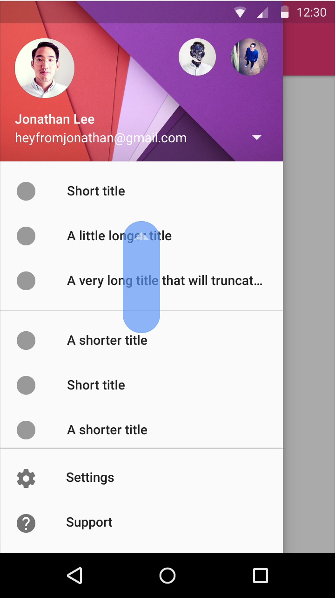
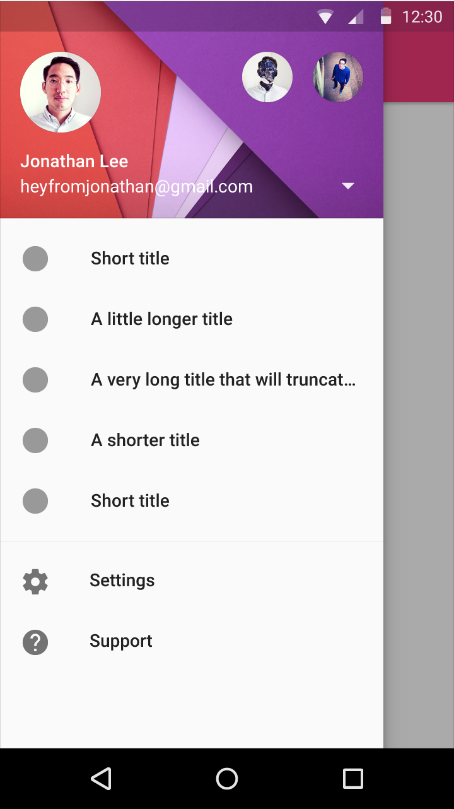

# 抽出式導航面板

導航抽出式面板在Google應用程式中是一個常見的模式。導航抽出式面板從左側滑進視窗中。它依循了列表的印刷關鍵線設計原則與量度。

> **印刷格式**
>
> 1. Roboto Medium, 14sp, #FFFFFF
> 2. Roboto Regular, 14sp, #FFFFFF
> 3. 列表物件: Roboto Medium, 14sp, 87% #000000
> 4. 次標題: Roboto Medium, 14sp, 54% #000000. 和16dp寬的關鍵線對齊

> **垂直的關鍵線和水平的邊緣**
>
> 讓圖示對齊的垂直關鍵線位於從左側以及導航面板的右側邊緣算起16dp的地方，並且為54% #000000。
>
> 和圖示或圖像相關的內容對齊於從導航面板左側邊緣算起72dp的位置。
>
> 導航面板的寬度等於畫面寬度減掉功能列的高度，在這個例子中即為從畫面右邊算起56dp。
>
> 在行動裝置上使用16dp寬的水平邊緣。

> **垂直間隔**
>
> 1. 24dp
> 2. 56dp
> 3. 8dp
> 4. 48dp
>
> 在每個列表群組的上方和底部加上8dp的padding。有一個例外是次標題下方最上面那個列表，因為次標題自己已經有padding了。

## 提升高度

導航抽出式面板跨越整個螢幕的高度，而且面板是在狀態列的底下。

> Android上的抽出式導航面板

## 選取狀態

當一個列表物件被選取了，那個物件變成應用程式的主要顏色或者#000000 100%來明確的表達選取狀態。點擊漣漪也變成強調效果來更加凸顯選取狀態。

如果點擊漣漪（強調效果）不能提供和你的主色調足夠的對比，那就使用以主色調再深一點的色調。

## 分隔線

所有在導航面板中的分隔線都是面板中的全出血版。同樣的分隔線上下也有8dp的padding。

> 內文

> 8 dp的垂直間距

## 捲動

抽出式導航面板跟任何畫面一樣都可以捲動。

## 設定與支援

設定與支援位於捲動列表的底部，和其他列表內容相同。

如果抽出式導航面板的列表內容很長，這兩個選項可以釘住在一個高度較高的平面上置放于抽出式導航面板的底部。這個平面只當位於列表頂部時才顯示，任何其他捲動位置會立即讓該平面消失且移到列表底部和其列表內容相同。抽出式導航面板的底部在關閉或開啟時會保持捲動位置。

如果列表不會捲動，設定與支援選項會顯示在列表最後而且不會釘住。

註：抽出式導航面板（Navigation drawer）
註：印刷關鍵線設計原則（keylines）
註：全流血版（full-bleed）
