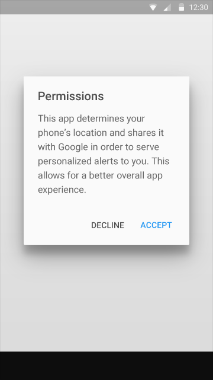

# Promoted Actions

## Floating Action Button

Floating action buttons are a special case of promoted actions. They are distinguished by a circled icon floating above the UI and have special motion behaviors, related to morphing, launching, and its transferring anchor point.

There are two sizes of floating action buttons: the default size and the mini, which should only be used to create visual continuity with other elements on the screen.
 
 
 

### Associated Content

Not every screen needs a floating action button. A floating action button should represent the primary action in an application. In the screen on the left, the primary action is to touch and open images in a gallery, so no floating action button is needed. On the right, the primary action is to add files. A floating action buton is appropriate.

 
> Do.

 
> Do.

Try to use only one floating action button per screen, as it is the most prominent button on the screen.
 

> Don't.
 

> Don't.

Don’t use floating action buttons in dialogs. Use a flat button.

> Do.
 

> Don't.

Don’t attach a floating action button to a side drawer; it could distract a user from the task they want to accomplish. Side drawers are for navigation.
 

> Do.
 

> Don't.

Don’t associate floating action buttons with pulldown menus.

> Do.

> Don't.

### Related Actions

Put overflow actions in the overflow menu in toolbars, not in floating action buttons.

> Do.

> Do.

 
> Don't.

> Don't.

If the hallmark of the app is adding filetypes, a floating action button can morph into related actions after it is initially touched.

> Do.

 
> Do.

However, if a set of actions that appear after touching a floating action button are unrelated to the button and are not a natural extension of it, then the actions should probably go into an overflow menu.

> Don't.

 
> Don't.

If a floating action button morphs into a toolbar, that toolbar should contain related actions. In this example, the button lets the user select the media type to add.

 
> Do.

> Do.

Don’t morph floating action buttons into a toolbar that contains unrelated or confusing actions.

 

> Don't.

 
> Don't.

A floating action button can contain a list of contacts.

> Do.

 

> Do.

It shouldn’t contain unrelated actions.

 
> Don't.

 
> Don't.

### Qualities

Make floating action buttons positive actions like Create, Favorite, Share, Navigate, and Explore.

> Do.

In general, avoid using floating action buttons for destructive actions like Archive or Trash; unspecific actions; alerts or errors; limited tasks like cutting text; or controls that should be in a toolbar, like volume control or changing a font color. Floating action buttons don’t contain app bar icons or status bar info like notifications. Don’t layer badges or other elements over a floating action button.

 
> Don't.

Use the circle-shaped icon consistently so as not to confuse users.

 

> Do.

> Don't.

Don’t make floating action buttons bounce.

 
> Do.

 
Don't.

### Placement

A floating action button can be placed according to the keyline spacing rules or attached to an extended app bar.

 
> Do.

 
> Do.

A floating action button can attach to a footer or to an extended sheet.

 
> Do.

 
> Do.

A floating action button shouldn’t float in a random location. Take care when attaching floating action buttons to a toolbar, where it might overlap with or cover other touch targets.

 
> Don't.

 
> Don't.

A floating action button can attach to an extended head.

 
> Do.

A floating action button can be attached to a toolbar or structural element within a sheet (as long as it’s not blocking other elements).

 
> Do.

A floating action button can be attached to the edge of a sheet.

 
> Do.

Don’t have more than one floating action button per screen.
 

> Don't.

Don’t place floating action buttons inside a drawer or attached to a drawer.

 
> Don't.

Don’t associate floating action buttons with every element on a screen.

 
> Don't.

Don’t block floating action buttons with snackbars or toasts.
 

 
> Do.

 
> Don't.

