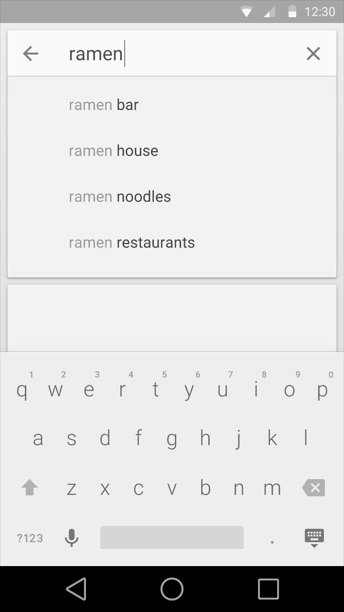
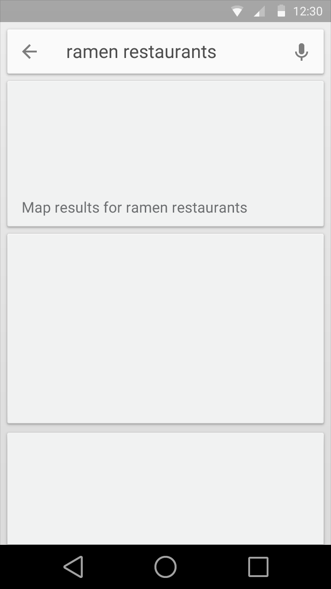
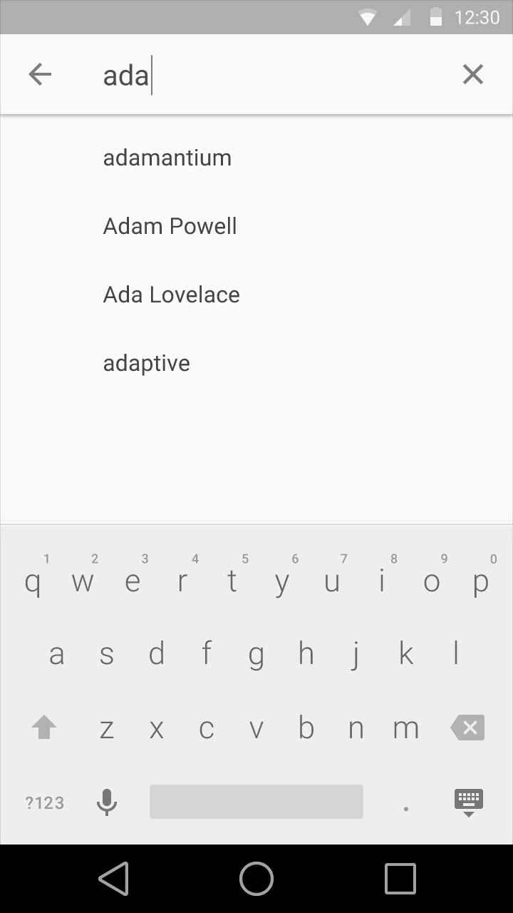
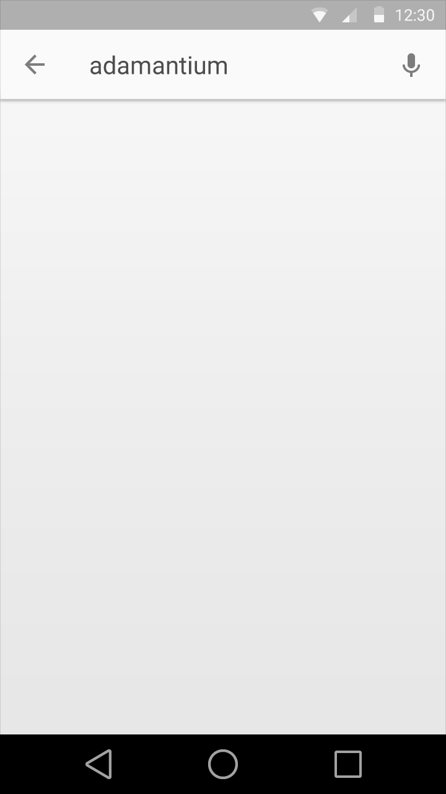

# 搜尋

## 應用程式內搜尋

當一個應用程式保有大量資訊時，使用者會希望能夠透過搜尋馬上找到特定內容。

最基本形式的搜尋意味著：

- 開啟一個搜尋文字框
- 輸入搜尋條件並進行查詢
- 呈現一組搜尋結果

然而透過一些增強，搜尋經驗可以變得更受矚目更令人滿意的：

- 支援語音搜尋
- 在使用者進行搜尋前，根據近期使用者的歷史搜尋紀錄提供建議
- 提供自動完成的搜尋建議，且這些建議與你的應用程式資料搜尋結果相符合(亦即這些建議都是應用程式內的資料)

There are two major patterns for in-app search: **persistent search** and **expandable search.**

應用程式內搜尋有兩個主要的模式：**持續式搜尋**與**可擴展式搜尋**。

## 持續式搜尋

當搜尋是你的應用程式的主要重點功能時，持續式搜尋是適當的方式。

搜尋的文字欄位是呈現在一個嵌入的搜尋框內，隨時準備好被啟動使用。

使用者可以透過觸控麥克風裝置，開啟語音搜尋。

> 當搜尋欄位被啟動使用時，搜尋框會展開並呈現依據歷史搜尋紀錄所做的建議，鍵盤也會視需要顯示在螢幕上，若使用者選擇了任何建議，就是提交系統執行這個建議的搜尋，點擊向上的箭頭圖示放棄搜尋，取消系統建議清單以及螢幕鍵盤。

> 當使用者開始輸入查詢的關鍵字時，搜尋系統會依據輸入的關鍵字變換自動完成的選項。
>
> 點擊搜尋框旁的'x'會全部清除使用者輸入的關鍵字。
>
> 選擇一個搜尋建議項目或按下返回鍵都會提交系統執行這個搜尋。

> 顯示搜尋結果時，仍然顯示搜尋框，只是未被聚焦啟用，為了顯示更多的搜尋結果，螢幕鍵盤被收起來了。
> 
> 為了與嵌入式搜尋框的外觀相稱，搜尋結果會以卡片方式編排，這樣的樣式可以適應各樣不同型態的搜尋結果。

## 可擴展式搜尋

當搜尋不是你的應用程式的主要重點功能時，可擴展式搜尋是適當的方式。

不再顯示搜尋文字欄位，取而代之，搜尋功能(以放大鏡圖案表示)顯示在工具列中。

> 觸控搜尋圖示時，工具列會改變樣式，清除其它的內容並顯示一個搜尋文字框，若有支援語音搜尋，同時會顯示麥克風圖示。
> 
> 搜尋文字欄位會自動接收使用者的聚焦啟用，如果需要的話螢幕鍵盤也會一起顯示。歷史搜尋建議可以顯示在工具列下，取代之前顯示的內容，選擇任何一個搜尋建議的項目就是向系統提交執行這個搜尋。
> 
> 觸控向上箭頭的圖示關閉搜尋模式，並且恢復工具列原來的顯示方式。

> 當使用者開始輸入查詢的關鍵字時，搜尋系統會依據輸入的關鍵字變換自動完成的選項。
>
> 點擊搜尋框旁的'x'會全部清除使用者輸入的關鍵字。
> 
> 選擇一個搜尋建議項目或按下返回鍵都會提交系統執行這個搜尋。

> 顯示搜尋結果時，工具列仍然保持搜尋模式，只是未被聚焦啟用。為了顯示更多的搜尋結果，螢幕鍵盤被收起來了。
>
> 就像前面所建議的一樣，搜尋結果顯示在工具列下方的頁面主要區域。

> *翻譯：[Charlene](https://www.facebook.com/charlene.feng.7)*

