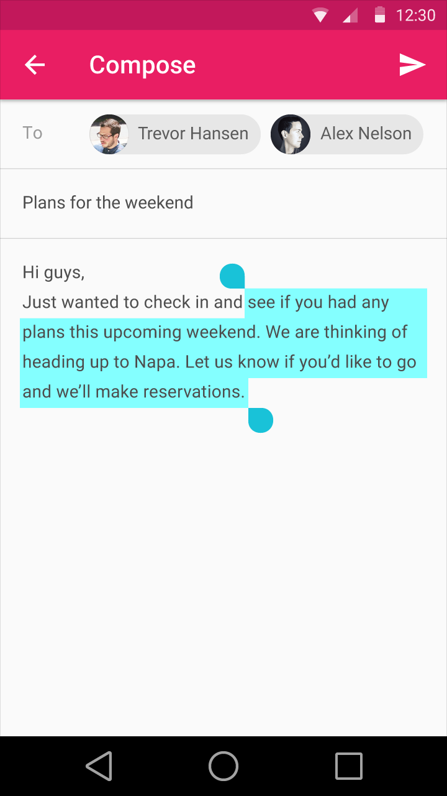
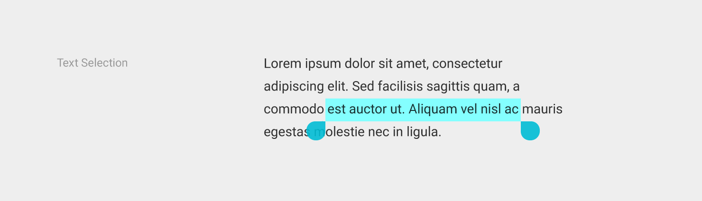
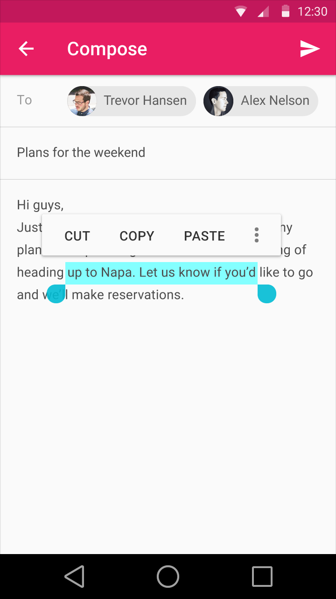
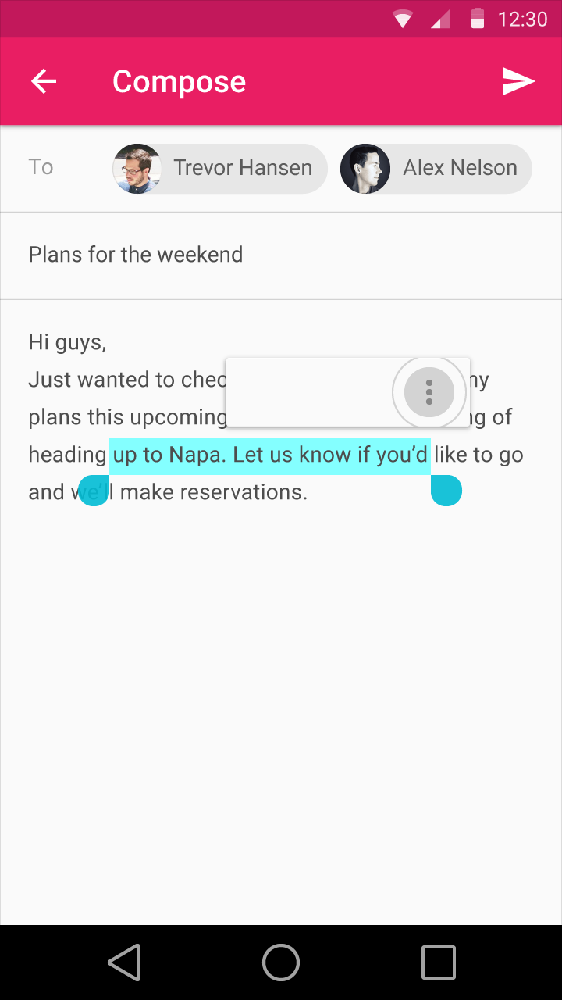
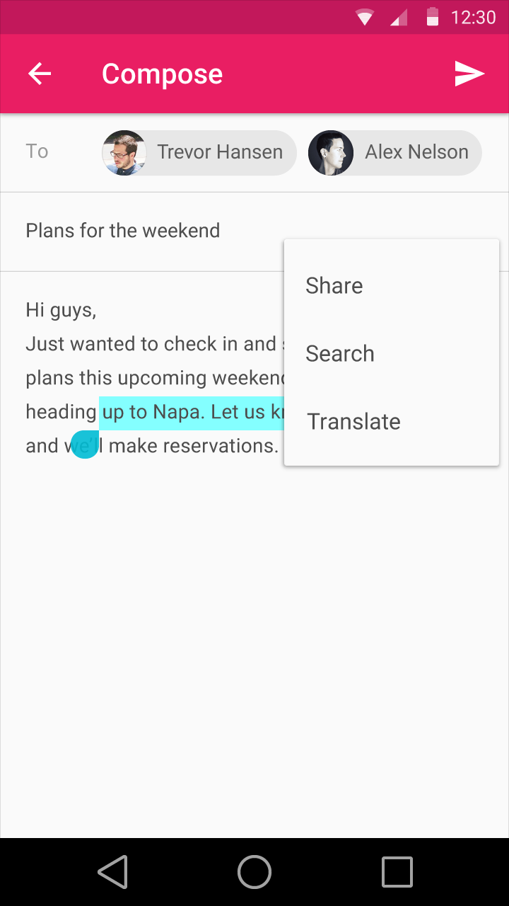
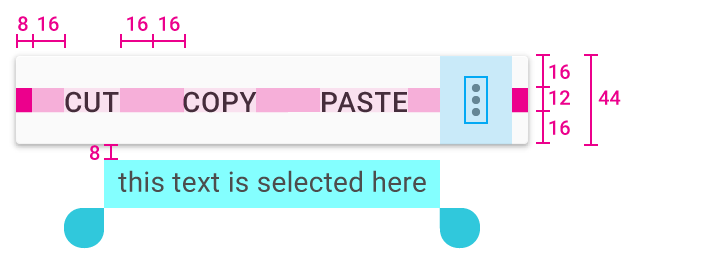

# 選擇

## 項目選擇

### 項目選擇

多重選項的支援可強烈推薦給清單和網格使用者(grid container)，然而，如果只有一個可用的動作是固定單一選擇的（像是電話號碼清單—只有撥打電話的動作）；或是如果內容是強烈指向直接、單一滑動（像是移動安卓手機上的主頁圖示(icon)），就沒有這麼必要了。

在一開始的選擇時，曳拉的手勢可能延伸成長按及兩指觸碰以選擇多重的項目。其他項目如開始與結束點的曳拉亦將包含於其中。在桌上型電腦中，簡單的曳拉由外而內的方向也可以用來啟動多重選項（舉例來說：從左側邊緣的清單曳拉開始，由此延伸到右邊的多個項目選擇。）

當一開始的選項已完成，則可藉由使用者的動作的順序以變更它：

- 觸碰以「選擇尚未選擇的項目」，或「讓已選擇的項目變為未選擇」。
- 按住Shift加上觸碰／點擊項目以在所有項目中，由此選項跳到另一選項。

## 文字選擇

文字選擇將會由已選擇文字的劃線方向來顯示。

在手機的平台上，一個選項的處理會被夾在開始與結束的選項中。最理想關於文字在清單上跳出的標準動作是讓文字立即地在下面出現（但最好不要重疊到選項本身）。

文字選擇處理

文字選擇 — 亮主題

文字選擇 — 暗主題

剪下、拷貝、貼上及更多於以上出現的選項區域之跳出清單，當使用者選擇「更多」的鈕時，則跳出的樣子將會往圖示方向倒，而跑出的清單將會從圖示中心往外變大。在字型的文字選擇清單上是Roboto Medium 14sp,app,caps.

文字選擇是一種有效地單選內容，如同選項必須在臨近的區塊一樣。然而，選項的方向可能會隨著使用者動作的次數而改變。

- 曳拉開始的選項以延展選項（之）
- 曳拉選項的處理以延展或減少選項（之）
- 在選項間重複地觸碰或點擊以延展之（單個字>段落>全部）
- 鍵盤熱鍵
	- 逐字地按住Shift+Left/Right箭頭
	- 逐行地按住Shift+Up/Down箭頭
	- Crl/Command+A以選擇全部€

---

> *翻譯： [Frances](https://www.facebook.com/Francishuang1224)*
