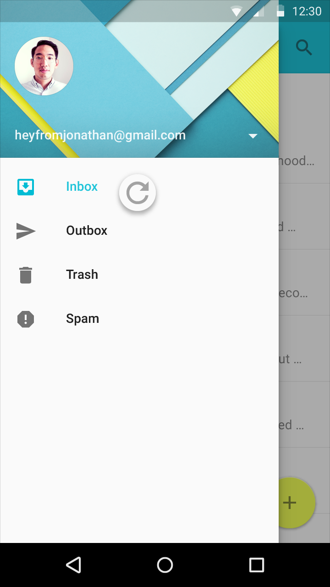
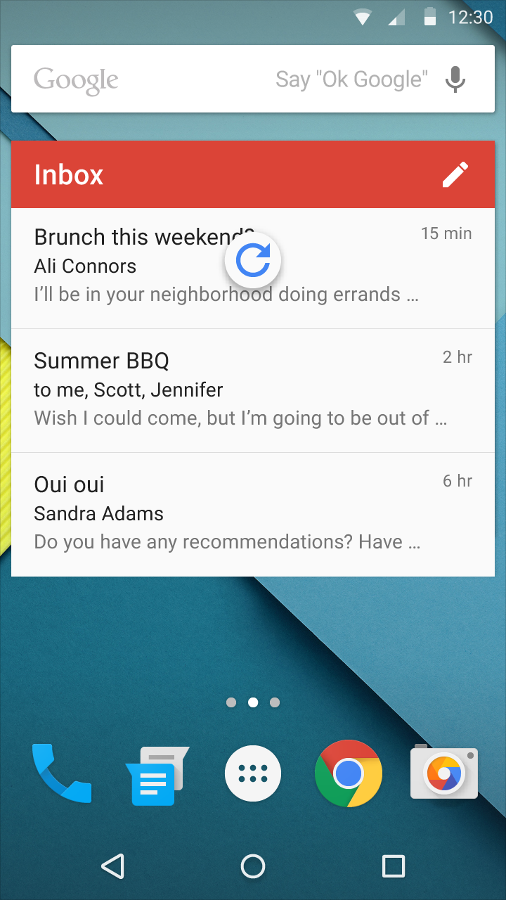
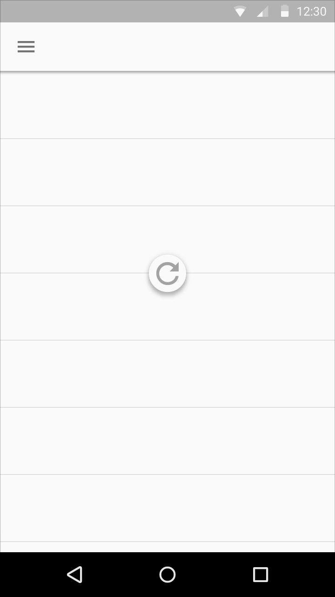

# 滑動更新

## 滑動更新

### 更新內容

有兩種方式可以更新一個應用程式中的內容。推薦的方式是用[同步](http://developer.android.com/training/sync-adapters/index.html)自動更新內容。同步是一種應用程式用來週期性地與自動地保持內容保持最新的狀態。推薦使用同步是因為這不需要用戶執行動作，而可以讓用戶對於他們隨時在看的內容有自信是最新的。

另一個是用手動更新的方式。更新需要用戶利用執行動作或滑動更新手勢來啟動內容更新。更新可以用來補充同步不足之處，比如說當在Gmail中檢查新信件或在Google+中檢查通知訊息時。一個明確的更新動作使用戶能更新內容同時也保持他們當下的捲動位置。

### 滑動更新

滑動更新是一個可以在列表、網格與卡片式群組的起點處，也就是大部份最新內容出現的地方所使用的[滑動手勢](http://www.google.com/design/spec/patterns/gestures.html#gestures-gestures)。一般來說，這個手勢是在內容集合的最頂端使用的，但是也能是在最底部（像是在聊天軟體中）。最好是利用這個手勢來提供常常更新的，且在同一個固定位置顯示的動態內容，那個位置要是能確保用戶啟動這個手勢後有較高機率看到新內容的地方。

要注意的是當滑動更新手勢被使用，畫面會大幅度改變或是被更新內容完全取代的這些變動可能不是可以立即呈現給用戶的。舉例來說，更新內容可能會不按順序的刪除、重新排列、修改與插入物件或是改變螢幕之外的物件。

<video controls="" width="360" height="640">
<source src="//material-design.storage.googleapis.com/publish/v_1/quantumexternal/0B8v7jImPsDi-emowalNnNloyODQ/070601_swipeToRefresh_xdpi_v10b.webm" type="video/webm">
<source src="//material-design.storage.googleapis.com/publish/v_1/quantumexternal/0B8v7jImPsDi-c2oyLU9wdFlkcTQ/070601_swipeToRefresh_xdpi_v10b.mp4" type="video/mp4">
</video>

滑動更新不應該被使用在下面的情形中：

> Don't.
>
> 抽出式導覽面板（如果應用程式中有的話）包含了導覽目的地，這並不是動態內容。

> Don't.
>
> 主視窗的小工具不應該自動更新內容。

> Don't.
>
> 掏金式內容，像是地圖，沒有主要的方向或內容起點能讓用戶能預想到滑動更新將從什麼地方啟動。

### 更新中指示器的位置與行為

更新中指示器預設位置永遠都是水平置中於欲更新內容的。

> Do.

> Don't.

> Don't.

更新中指示器永遠都位於接近欲更新內容的頂部。

Y軸的更新中指示器預設位置可以調整，所以它的位置可以和底下的格式在視覺上保持和諧。比方說，指示器可以在material邊緣或是網格線上，當是它應當永遠都位於接近欲更新內容的頂部。

> Do.

> Don't.

更新中指示器在更新動作完成且新內容顯示了，或者用戶移動到欲更新內容外之前要保持在顯示狀態。

更新中指示器只會在更新手勢或更新動作後面才顯示。同步並不會呈現更新中指示器。

<video controls="" width="360" height="640">
<source src="//material-design.storage.googleapis.com/publish/v_1/quantumexternal/0B8v7jImPsDi-WVZuSVBKbUc2bDQ/070601_posSwipeYes_xdpi_v07a.webm" type="video/webm">
<source src="//material-design.storage.googleapis.com/publish/v_1/quantumexternal/0B8v7jImPsDi-Q2lQWWtLTGhrOXM/070601_posSwipeYes_xdpi_v07a.mp4" type="video/mp4">
</video>

> Do.

<video controls="" width="360" height="640">
<source src="//material-design.storage.googleapis.com/publish/v_1/quantumexternal/0B8v7jImPsDi-TGhDY0hxcVJ4Q28/070601_posSwipeNo_xdpi_v07a.webm" type="video/webm">
<source src="//material-design.storage.googleapis.com/publish/v_1/quantumexternal/0B8v7jImPsDi-N002cDVnVFV1RFE/070601_posSwipeNo_xdpi_v07a.mp4" type="video/mp4">
</video>

> Don't.

### 更新中指示器動畫

當另一個表面在z軸上位於包含欲更新內容的material之上時，更新中指示器從下方移動上來，並且當它完整顯示時是簡潔的。

When the material containing the refreshing content is positioned in z-space either above every other surface or seamed with a coplanar surface, the refresh indicator scales up in size as it translates.

當透過應用程式列的動作或者浮現選單來啟動內容更新時，更新中指示器從它的預設位置跳出來呈現。

<video controls="" width="360" height="171">
=<source src="//material-design.storage.googleapis.com/publish/v_1/quantumexternal/0B8v7jImPsDi-QWV6MDk4Tkp5VWc/070601_scaleOverApp_xdpi_v06a.webm" type="video/webm">
=<source src="//material-design.storage.googleapis.com/publish/v_1/quantumexternal/0B8v7jImPsDi-UGhMUlVXUVhnVzQ/070601_scaleOverApp_xdpi_v06a.mp4" type="video/mp4">
=</video>

<video controls="" width="360" height="640">
<source src="//material-design.storage.googleapis.com/publish/v_1/quantumexternal/0B8v7jImPsDi-MHhEMDBickE4MGc/070601_scaleCopApp_xdpi_v07a.webm" type="video/webm">
<source src="//material-design.storage.googleapis.com/publish/v_1/quantumexternal/0B8v7jImPsDi-aTZvSzFsSnV5ckk/070601_scaleCopApp_xdpi_v07a.mp4" type="video/mp4">
</video>

更新與另一個表面同層的內容

<video controls="" width="360" height="640">
<source src="//material-design.storage.googleapis.com/publish/v_1/quantumexternal/0B8v7jImPsDi-TXBQVFo1X242anc/070601_clipped_xdpi_v04a.webm" type="video/webm">
<source src="//material-design.storage.googleapis.com/publish/v_1/quantumexternal/0B8v7jImPsDi-WDVrVjFoMjIxekU/070601_clipped_xdpi_v04a.mp4" type="video/mp4">
</video>

更新位於下方另一個表面的內容

<video controls="" width="360" height="640">
<source src="//material-design.storage.googleapis.com/publish/v_1/quantumexternal/0B8v7jImPsDi-MnJ6UEZCalhRUWM/070601_scaleInApp_xdpi_v06b.webm" type="video/webm">
<source src="//material-design.storage.googleapis.com/publish/v_1/quantumexternal/0B8v7jImPsDi-TlZNZ0U2dFpfZHM/070601_scaleInApp_xdpi_v06b.mp4" type="video/mp4">
</video>

利用應用程式列動作來更新內容

### 實作細節

當更新中指示器顯示或跳出至畫面上時，環形轉動圖示邊轉動邊呈現進畫面。

To ensure users intentionally initiate a refresh using the swipe to refresh gesture, the refresh indicator must pass a threshold before the app will begin to refresh. This threshold is indicated through a number of cues: the circular spinner reaches 100% opacity, the rotation of the circular spinner slows down, and the rate of translation of the refresh indicator slows down.

Completing the gesture at any point after passing the threshold will initiate the refresh action.

Reversing the gesture past the threshold will cancel the initiation of the refresh action.

> *翻譯： [Sean Chen](https://www.facebook.com/shihneng.chen)*

