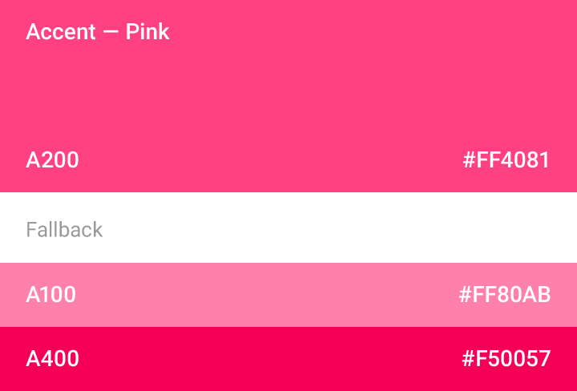
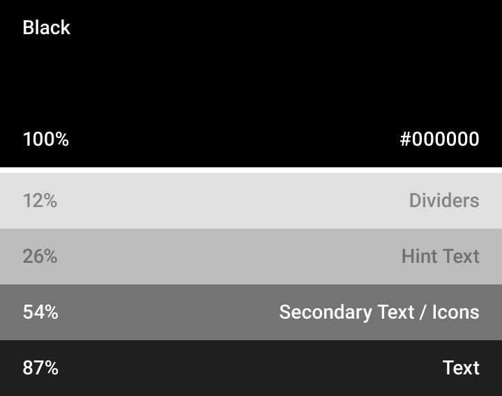

# Color

Color is inspired by bold color statements juxtaposed with muted environments, taking cues from contemporary architecture, road signs, pavement marking tape, and sports courts. Emphasize bold shadows and highlights. Introduce unexpected and vibrant colors.

> [Color Swatch](http://quantum-paper.storage.googleapis.com/downloads/color_swatches.zip)
 
---

## Color Palette

This color palette comprises primary and accent colors that can be used for illustration or to develop your brand colors. They’ve been designed to work harmoniously with each other.

The color palette starts with primary colors and fills in the spectrum to create a complete and usable palette for Android, Web, and iOS. Google suggests using the 500 colors as the primary colors in your app and the other colors as accents colors.

<section class="color-group">
<ul>
<li class="color main-color" style="background-color: #e51c23;">
Red
500
#e51c23
</li>
<li class="color dark" style="background-color: #fde0dc;">50#fde0dc</li>
<li class="color dark" style="background-color: #f9bdbb;">100#f9bdbb</li>
<li class="color dark" style="background-color: #f69988;">200#f69988</li>
<li class="color dark" style="background-color: #f36c60;">300#f36c60</li>
<li class="color dark" style="background-color: #e84e40;">400#e84e40</li>
<li class="color light-strong" style="background-color: #e51c23;">500#e51c23</li>
<li class="color light-strong" style="background-color: #dd191d;">600#dd191d</li>
<li class="color light-strong" style="background-color: #d01716;">700#d01716</li>
<li class="color" style="background-color: #c41411;">800#c41411</li>
<li class="color" style="background-color: #b0120a;">900#b0120a</li>
<li class="color dark" style="background-color: #ff7997;">A100#ff7997</li>
<li class="color light-strong" style="background-color: #ff5177;">A200#ff5177</li>
<li class="color light-strong" style="background-color: #ff2d6f;">A400#ff2d6f</li>
<li class="color light-strong" style="background-color: #e00032;">A700#e00032</li>
</ul>
</section>

<section class="color-group">
<ul>
<li class="color main-color" style="background-color: #E91E63;">
Pink
500
#e91e63
</li>
<li class="color dark" style="background-color: #fce4ec;">50#fce4ec</li>
<li class="color dark" style="background-color: #f8bbd0;">100#f8bbd0</li>
<li class="color dark" style="background-color: #f48fb1;">200#f48fb1</li>
<li class="color dark" style="background-color: #f06292;">300#f06292</li>
<li class="color dark" style="background-color: #ec407a;">400#ec407a</li>
<li class="color light-strong" style="background-color: #e91e63;">500#e91e63</li>
<li class="color light-strong" style="background-color: #d81b60;">600#d81b60</li>
<li class="color" style="background-color: #c2185b;">700#c2185b</li>
<li class="color" style="background-color: #ad1457;">800#ad1457</li>
<li class="color" style="background-color: #880e4f;">900#880e4f</li>
<li class="color dark" style="background-color: #ff80ab;">A100#ff80ab</li>
<li class="color light-strong" style="background-color: #ff4081;">A200#ff4081</li>
<li class="color light-strong" style="background-color: #f50057;">A400#f50057</li>
<li class="color light-strong" style="background-color: #c51162;">A700#c51162</li>
</ul>
</section>

<section class="color-group">
<ul>
<li class="color main-color" style="background-color: #9c27b0;">
Purple
500
#9c27b0
</li>
<li class="color dark" style="background-color: #f3e5f5;">50#f3e5f5</li>
<li class="color dark" style="background-color: #e1bee7;">100#e1bee7</li>
<li class="color dark" style="background-color: #ce93d8;">200#ce93d8</li>
<li class="color light-strong" style="background-color: #ba68c8;">300#ba68c8</li>
<li class="color light-strong" style="background-color: #ab47bc;">400#ab47bc</li>
<li class="color" style="background-color: #9c27b0;">500#9c27b0</li>
<li class="color" style="background-color: #8e24aa;">600#8e24aa</li>
<li class="color" style="background-color: #7b1fa2;">700#7b1fa2</li>
<li class="color" style="background-color: #6a1b9a;">800#6a1b9a</li>
<li class="color" style="background-color: #4a148c;">900#4a148c</li>
<li class="color dark" style="background-color: #ea80fc;">A100#ea80fc</li>
<li class="color light-strong" style="background-color: #e040fb;">A200#e040fb</li>
<li class="color light-strong" style="background-color: #d500f9;">A400#d500f9</li>
<li class="color light-strong" style="background-color: #aa00ff;">A700#aa00ff</li>
</ul>
</section>

<section class="color-group">
<ul>
<li class="color main-color" style="background-color: #673ab7;">
Deep Purple
500
#673ab7
</li>
<li class="color dark" style="background-color: #ede7f6;">50#ede7f6</li>
<li class="color dark" style="background-color: #d1c4e9;">100#d1c4e9</li>
<li class="color dark" style="background-color: #b39ddb;">200#b39ddb</li>
<li class="color light-strong" style="background-color: #9575cd;">300#9575cd</li>
<li class="color light-strong" style="background-color: #7e57c2;">400#7e57c2</li>
<li class="color" style="background-color: #673ab7;">500#673ab7</li>
<li class="color" style="background-color: #5e35b1;">600#5e35b1</li>
<li class="color" style="background-color: #512da8;">700#512da8</li>
<li class="color" style="background-color: #4527a0;">800#4527a0</li>
<li class="color" style="background-color: #311b92;">900#311b92</li>
<li class="color dark" style="background-color: #b388ff;">A100#b388ff</li>
<li class="color light-strong" style="background-color: #7c4dff;">A200#7c4dff</li>
<li class="color" style="background-color: #651fff;">A400#651fff</li>
<li class="color" style="background-color: #6200ea;">A700#6200ea</li>
</ul>
</section>

<section class="color-group">
<ul>
<li class="color main-color" style="background-color: #3f51b5;">
Indigo
500
#3f51b5
</li>
<li class="color dark" style="background-color: #e8eaf6;">50#e8eaf6</li>
<li class="color dark" style="background-color: #c5cae9;">100#c5cae9</li>
<li class="color dark" style="background-color: #9fa8da;">200#9fa8da</li>
<li class="color light-strong" style="background-color: #7986cb;">300#7986cb</li>
<li class="color light-strong" style="background-color: #5c6bc0;">400#5c6bc0</li>
<li class="color" style="background-color: #3f51b5;">500#3f51b5</li>
<li class="color" style="background-color: #3949ab;">600#3949ab</li>
<li class="color" style="background-color: #303f9f;">700#303f9f</li>
<li class="color" style="background-color: #283593;">800#283593</li>
<li class="color" style="background-color: #1a237e;">900#1a237e</li>
<li class="color dark" style="background-color: #8c9eff;">A100#8c9eff</li>
<li class="color light-strong" style="background-color: #536dfe;">A200#536dfe</li>
<li class="color light-strong" style="background-color: #3d5afe;">A400#3d5afe</li>
<li class="color" style="background-color: #304ffe;">A700#304ffe</li>
</ul>
</section>

<section class="color-group">
<ul>
<li class="color main-color" style="background-color: #5677fc;">
Blue
500
#5677fc
</li>
<li class="color dark" style="background-color: #e7e9fd;">50#e7e9fd</li>
<li class="color dark" style="background-color: #d0d9ff;">100#d0d9ff</li>
<li class="color dark" style="background-color: #afbfff;">200#afbfff</li>
<li class="color dark" style="background-color: #91a7ff;">300#91a7ff</li>
<li class="color dark" style="background-color: #738ffe;">400#738ffe</li>
<li class="color light-strong" style="background-color: #5677fc;">500#5677fc</li>
<li class="color light-strong" style="background-color: #4e6cef;">600#4e6cef</li>
<li class="color light-strong" style="background-color: #455ede;">700#455ede</li>
<li class="color" style="background-color: #3b50ce;">800#3b50ce</li>
<li class="color" style="background-color: #2a36b1;">900#2a36b1</li>
<li class="color dark" style="background-color: #a6baff;">A100#a6baff</li>
<li class="color light-strong" style="background-color: #6889ff;">A200#6889ff</li>
<li class="color light-strong" style="background-color: #4d73ff;">A400#4d73ff</li>
<li class="color light-strong" style="background-color: #4d69ff;">A700#4d69ff</li>
</ul>
</section>

<section class="color-group">
<ul>
<li class="color main-color" style="background-color: #03a9f4;">
Light Blue
500
#03a9f4
</li>
<li class="color dark" style="background-color: #e1f5fe;">50#e1f5fe</li>
<li class="color dark" style="background-color: #b3e5fc;">100#b3e5fc</li>
<li class="color dark" style="background-color: #81d4fa;">200#81d4fa</li>
<li class="color dark" style="background-color: #4fc3f7;">300#4fc3f7</li>
<li class="color dark" style="background-color: #29b6f6;">400#29b6f6</li>
<li class="color light-strong" style="background-color: #03a9f4;">500#03a9f4</li>
<li class="color light-strong" style="background-color: #039be5;">600#039be5</li>
<li class="color light-strong" style="background-color: #0288d1;">700#0288d1</li>
<li class="color light-strong" style="background-color: #0277bd;">800#0277bd</li>
<li class="color" style="background-color: #01579b;">900#01579b</li>
<li class="color dark" style="background-color: #80d8ff;">A100#80d8ff</li>
<li class="color dark" style="background-color: #40c4ff;">A200#40c4ff</li>
<li class="color dark" style="background-color: #00b0ff;">A400#00b0ff</li>
<li class="color light-strong" style="background-color: #0091ea;">A700#0091ea</li>
</ul>
</section>

<section class="color-group">
<ul>
<li class="color main-color" style="background-color: #00bcd4;">
Cyan
500
#00bcd4
</li>
<li class="color dark" style="background-color: #e0f7fa;">50#e0f7fa</li>
<li class="color dark" style="background-color: #b2ebf2;">100#b2ebf2</li>
<li class="color dark" style="background-color: #80deea;">200#80deea</li>
<li class="color dark" style="background-color: #4dd0e1;">300#4dd0e1</li>
<li class="color dark" style="background-color: #26c6da;">400#26c6da</li>
<li class="color light-strong" style="background-color: #00bcd4;">500#00bcd4</li>
<li class="color light-strong" style="background-color: #00acc1;">600#00acc1</li>
<li class="color light-strong" style="background-color: #0097a7;">700#0097a7</li>
<li class="color light-strong" style="background-color: #00838f;">800#00838f</li>
<li class="color" style="background-color: #006064;">900#006064</li>
<li class="color dark" style="background-color: #84ffff;">A100#84ffff</li>
<li class="color dark" style="background-color: #18ffff;">A200#18ffff</li>
<li class="color dark" style="background-color: #00e5ff;">A400#00e5ff</li>
<li class="color dark" style="background-color: #00b8d4;">A700#00b8d4</li>
</ul>
</section>

<section class="color-group">
<ul>
<li class="color main-color" style="background-color: #009688;">
Teal
500
#009688
</li>
<li class="color dark" style="background-color: #e0f2f1;">50#e0f2f1</li>
<li class="color dark" style="background-color: #b2dfdb;">100#b2dfdb</li>
<li class="color dark" style="background-color: #80cbc4;">200#80cbc4</li>
<li class="color dark" style="background-color: #4db6ac;">300#4db6ac</li>
<li class="color dark" style="background-color: #26a69a;">400#26a69a</li>
<li class="color light-strong" style="background-color: #009688;">500#009688</li>
<li class="color light-strong" style="background-color: #00897b;">600#00897b</li>
<li class="color light-strong" style="background-color: #00796b;">700#00796b</li>
<li class="color" style="background-color: #00695c;">800#00695c</li>
<li class="color" style="background-color: #004d40;">900#004d40</li>
<li class="color dark" style="background-color: #a7ffeb;">A100#a7ffeb</li>
<li class="color dark" style="background-color: #64ffda;">A200#64ffda</li>
<li class="color dark" style="background-color: #1de9b6;">A400#1de9b6</li>
<li class="color dark" style="background-color: #00bfa5;">A700#00bfa5</li>
</ul>
</section>

<section class="color-group">
<ul>
<li class="color main-color" style="background-color: #259b24;">
Green
500
#259b24
</li>
<li class="color dark" style="background-color: #d0f8ce;">50#d0f8ce</li>
<li class="color dark" style="background-color: #a3e9a4;">100#a3e9a4</li>
<li class="color dark" style="background-color: #72d572;">200#72d572</li>
<li class="color dark" style="background-color: #42bd41;">300#42bd41</li>
<li class="color dark" style="background-color: #2baf2b;">400#2baf2b</li>
<li class="color light-strong" style="background-color: #259b24;">500#259b24</li>
<li class="color light-strong" style="background-color: #0a8f08;">600#0a8f08</li>
<li class="color light-strong" style="background-color: #0a7e07;">700#0a7e07</li>
<li class="color" style="background-color: #056f00;">800#056f00</li>
<li class="color" style="background-color: #0d5302;">900#0d5302</li>
<li class="color dark" style="background-color: #a2f78d;">A100#a2f78d</li>
<li class="color dark" style="background-color: #5af158;">A200#5af158</li>
<li class="color dark" style="background-color: #14e715;">A400#14e715</li>
<li class="color dark" style="background-color: #12c700;">A700#12c700</li>
</ul>
</section>

<section class="color-group">
<ul>
<li class="color main-color" style="background-color: #8bc34a;">
Light Green
500
#8bc34a
</li>
<li class="color dark" style="background-color: #f1f8e9;">50#f1f8e9</li>
<li class="color dark" style="background-color: #dcedc8;">100#dcedc8</li>
<li class="color dark" style="background-color: #c5e1a5;">200#c5e1a5</li>
<li class="color dark" style="background-color: #aed581;">300#aed581</li>
<li class="color dark" style="background-color: #9ccc65;">400#9ccc65</li>
<li class="color dark-when-small" style="background-color: #8bc34a;">500#8bc34a</li>
<li class="color dark-when-small" style="background-color: #7cb342;">600#7cb342</li>
<li class="color dark-when-small" style="background-color: #689f38;">700#689f38</li>
<li class="color light-strong" style="background-color: #558b2f;">800#558b2f</li>
<li class="color light-strong" style="background-color: #33691e;">900#33691e</li>
<li class="color dark" style="background-color: #ccff90;">A100#ccff90</li>
<li class="color dark" style="background-color: #b2ff59;">A200#b2ff59</li>
<li class="color dark" style="background-color: #76ff03;">A400#76ff03</li>
<li class="color dark" style="background-color: #64dd17;">A700#64dd17</li>
</ul>
</section>

<section class="color-group">
<ul>
<li class="color main-color" style="background-color: #cddc39;">
Lime
500
#cddc39
</li>
<li class="color dark" style="background-color: #f9fbe7;">50#f9fbe7</li>
<li class="color dark" style="background-color: #f0f4c3;">100#f0f4c3</li>
<li class="color dark" style="background-color: #e6ee9c;">200#e6ee9c</li>
<li class="color dark" style="background-color: #dce775;">300#dce775</li>
<li class="color dark" style="background-color: #d4e157;">400#d4e157</li>
<li class="color dark" style="background-color: #cddc39;">500#cddc39</li>
<li class="color dark" style="background-color: #c0ca33;">600#c0ca33</li>
<li class="color dark-when-small" style="background-color: #afb42b;">700#afb42b</li>
<li class="color dark-when-small" style="background-color: #9e9d24;">800#9e9d24</li>
<li class="color light-strong" style="background-color: #827717;">900#827717</li>
<li class="color dark" style="background-color: #f4ff81;">A100#f4ff81</li>
<li class="color dark" style="background-color: #eeff41;">A200#eeff41</li>
<li class="color dark" style="background-color: #c6ff00;">A400#c6ff00</li>
<li class="color dark" style="background-color: #aeea00;">A700#aeea00</li>
</ul>
</section>

<section class="color-group">
<ul>
<li class="color main-color" style="background-color: #ffeb3b;">
Yellow
500
#ffeb3b
</li>
<li class="color dark" style="background-color: #fffde7;">50#fffde7</li>
<li class="color dark" style="background-color: #fff9c4;">100#fff9c4</li>
<li class="color dark" style="background-color: #fff59d;">200#fff59d</li>
<li class="color dark" style="background-color: #fff176;">300#fff176</li>
<li class="color dark" style="background-color: #ffee58;">400#ffee58</li>
<li class="color dark" style="background-color: #ffeb3b;">500#ffeb3b</li>
<li class="color dark" style="background-color: #fdd835;">600#fdd835</li>
<li class="color dark" style="background-color: #fbc02d;">700#fbc02d</li>
<li class="color dark" style="background-color: #f9a825;">800#f9a825</li>
<li class="color dark-when-small" style="background-color: #f57f17;">900#f57f17</li>
<li class="color dark" style="background-color: #ffff8d;">A100#ffff8d</li>
<li class="color dark" style="background-color: #ffff00;">A200#ffff00</li>
<li class="color dark" style="background-color: #ffea00;">A400#ffea00</li>
<li class="color dark" style="background-color: #ffd600;">A700#ffd600</li>
</ul>
</section>

<section class="color-group">
<ul>
<li class="color main-color" style="background-color: #ffc107;">
Amber
500
#ffc107
</li>
<li class="color dark" style="background-color: #fff8e1;">50#fff8e1</li>
<li class="color dark" style="background-color: #ffecb3;">100#ffecb3</li>
<li class="color dark" style="background-color: #ffe082;">200#ffe082</li>
<li class="color dark" style="background-color: #ffd54f;">300#ffd54f</li>
<li class="color dark" style="background-color: #ffca28;">400#ffca28</li>
<li class="color dark" style="background-color: #ffc107;">500#ffc107</li>
<li class="color dark" style="background-color: #ffb300;">600#ffb300</li>
<li class="color dark-when-small" style="background-color: #ffa000;">700#ffa000</li>
<li class="color dark-when-small" style="background-color: #ff8f00;">800#ff8f00</li>
<li class="color dark-when-small" style="background-color: #ff6f00;">900#ff6f00</li>
<li class="color dark" style="background-color: #ffe57f;">A100#ffe57f</li>
<li class="color dark" style="background-color: #ffd740;">A200#ffd740</li>
<li class="color dark" style="background-color: #ffc400;">A400#ffc400</li>
<li class="color dark" style="background-color: #ffab00;">A700#ffab00</li>
</ul>
</section>

<section class="color-group">
<ul>
<li class="color main-color" style="background-color: #ff9800;">
Orange
500
#ff9800
</li>
<li class="color dark" style="background-color: #fff3e0;">50#fff3e0</li>
<li class="color dark" style="background-color: #ffe0b2;">100#ffe0b2</li>
<li class="color dark" style="background-color: #ffcc80;">200#ffcc80</li>
<li class="color dark" style="background-color: #ffb74d;">300#ffb74d</li>
<li class="color dark" style="background-color: #ffa726;">400#ffa726</li>
<li class="color dark-when-small" style="background-color: #ff9800;">500#ff9800</li>
<li class="color dark-when-small" style="background-color: #fb8c00;">600#fb8c00</li>
<li class="color dark-when-small" style="background-color: #f57c00;">700#f57c00</li>
<li class="color light-strong" style="background-color: #ef6c00;">800#ef6c00</li>
<li class="color light-strong" style="background-color: #e65100;">900#e65100</li>
<li class="color dark" style="background-color: #ffd180;">A100#ffd180</li>
<li class="color dark" style="background-color: #ffab40;">A200#ffab40</li>
<li class="color dark" style="background-color: #ff9100;">A400#ff9100</li>
<li class="color dark-strong" style="background-color: #ff6d00;">A700#ff6d00</li>
</ul>
</section>

<section class="color-group">
<ul>
<li class="color main-color" style="background-color: #ff5722;">
Deep Orange
500
#ff5722
</li>
<li class="color dark" style="background-color: #fbe9e7;">50#fbe9e7</li>
<li class="color dark" style="background-color: #ffccbc;">100#ffccbc</li>
<li class="color dark" style="background-color: #ffab91;">200#ffab91</li>
<li class="color dark" style="background-color: #ff8a65;">300#ff8a65</li>
<li class="color dark" style="background-color: #ff7043;">400#ff7043</li>
<li class="color light-strong" style="background-color: #ff5722;">500#ff5722</li>
<li class="color light-strong" style="background-color: #f4511e;">600#f4511e</li>
<li class="color light-strong" style="background-color: #e64a19;">700#e64a19</li>
<li class="color light-strong" style="background-color: #d84315;">800#d84315</li>
<li class="color light-strong" style="background-color: #bf360c;">900#bf360c</li>
<li class="color dark" style="background-color: #ff9e80;">A100#ff9e80</li>
<li class="color dark" style="background-color: #ff6e40;">A200#ff6e40</li>
<li class="color light-strong" style="background-color: #ff3d00;">A400#ff3d00</li>
<li class="color light-strong" style="background-color: #dd2c00;">A700#dd2c00</li>
</ul>
</section>

<section class="color-group">
<ul>
<li class="color main-color" style="background-color: #795548;">
Brown
500
#795548
</li>
<li class="color dark" style="background-color: #efebe9;">50#efebe9</li>
<li class="color dark" style="background-color: #d7ccc8;">100#d7ccc8</li>
<li class="color dark" style="background-color: #bcaaa4;">200#bcaaa4</li>
<li class="color light-strong" style="background-color: #a1887f;">300#a1887f</li>
<li class="color light-strong" style="background-color: #8d6e63;">400#8d6e63</li>
<li class="color" style="background-color: #795548;">500#795548</li>
<li class="color" style="background-color: #6d4c41;">600#6d4c41</li>
<li class="color" style="background-color: #5d4037;">700#5d4037</li>
<li class="color" style="background-color: #4e342e;">800#4e342e</li>
<li class="color" style="background-color: #3e2723;">900#3e2723</li>
</ul>
</section>

<section class="color-group">
<ul>
<li class="color main-color" style="background-color: #9e9e9e;">
Grey
500
#9e9e9e
</li>
<li class="color dark" style="background-color: #fafafa;">50#fafafa</li>
<li class="color dark" style="background-color: #f5f5f5;">100#f5f5f5</li>
<li class="color dark" style="background-color: #eeeeee;">200#eeeeee</li>
<li class="color dark" style="background-color: #e0e0e0;">300#e0e0e0</li>
<li class="color dark" style="background-color: #bdbdbd;">400#bdbdbd</li>
<li class="color dark-when-small" style="background-color: #9e9e9e;">500#9e9e9e</li>
<li class="color" style="background-color: #757575;">600#757575</li>
<li class="color" style="background-color: #616161;">700#616161</li>
<li class="color" style="background-color: #424242;">800#424242</li>
<li class="color" style="background-color: #212121;">900#212121</li>
<li class="color" style="background-color: #000000;">1000#000000</li>
<li class="color dark" style="background-color: #ffffff;">1000#ffffff</li>
</ul>
</section>

<section class="color-group">
<ul>
<li class="color main-color" style="background-color: #607d8b;">
Blue Grey
500
#607d8b
</li>
<li class="color dark" style="background-color: #eceff1;">50#eceff1</li>
<li class="color dark" style="background-color: #cfd8dc;">100#cfd8dc</li>
<li class="color dark" style="background-color: #b0bec5;">200#b0bec5</li>
<li class="color dark" style="background-color: #90a4ae;">300#90a4ae</li>
<li class="color light-strong" style="background-color: #78909c;">400#78909c</li>
<li class="color light-strong" style="background-color: #607d8b;">500#607d8b</li>
<li class="color" style="background-color: #546e7a;">600#546e7a</li>
<li class="color" style="background-color: #455a64;">700#455a64</li>
<li class="color" style="background-color: #37474f;">800#37474f</li>
<li class="color" style="background-color: #263238;">900#263238</li>
</ul>
</section>

---

## UI Color Application

### Choose your palette

Limit your selection of colors by choosing three color hues from the primary palette and one accent color from the secondary palette. The accent color may or may not need fallback options.

### Use alpha values for grey text, icons, and dividers

To effectively convey the hierarchy of information, use different shades for text. The standard alpha value for text on a white background is 87% (#000000). Secondary text, which is lower in the visual hierarchy, should have an alpha value of 54% (#000000). Text hints for users, like those in text fields and labels, have an even lower visual prominence and should have an alpha value of 26% (#000000).

Other elements, such as icons and dividers, also benefit from having an alpha value of black instead of a solid color, to make sure that they work on backgrounds of any color.

For white or black text on colored backgrounds, see these tables of color palettes for the appropriate contrast ratios and alpha values.

Bold use of color in large fields in the UI is strongly encouraged. Different elements in the UI will take on different parts of the color theme. Toolbars and larger color blocks will take on the primary 500. This is the main color of your app. The status bar should be the darker 700 tint of your primary color.

### Accent color

The vibrant accent color are used for your primary action buttons as well as components such as switchers or sliders. Left aligned section icons or section titles can also take on the accent color

### Fallback accent colors

If your accent color is to light or dark for the background color the general fallback rule is to choose a darker or lighter tint of the accent color. If your accent color doesn’t work at all, fall back to use the primary 500 color on white backgrounds. If the background color is the primary 500 color fall back to white 100% or black 54%.

---

## Themes

Themes are a way to apply a consistent tone to an app. The style specifies the darkness of the surfaces, level of shadow, and appropriate opacity of ink elements. To promote greater consistency between apps, two themes are available:

- Light
- Dark

> [Theme](http://material-design.storage.googleapis.com/downloads/stickersheet_uielements.ai)

