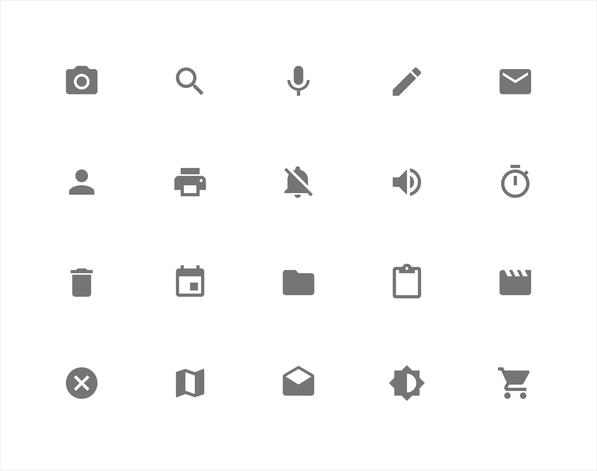
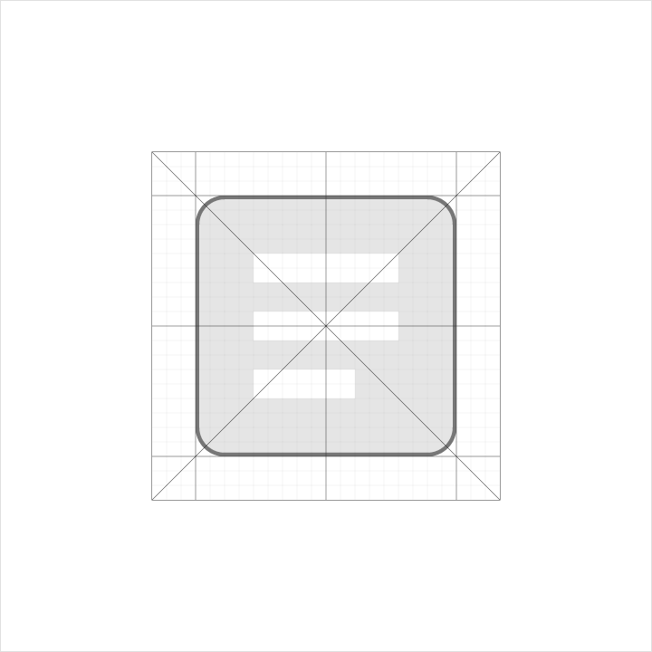
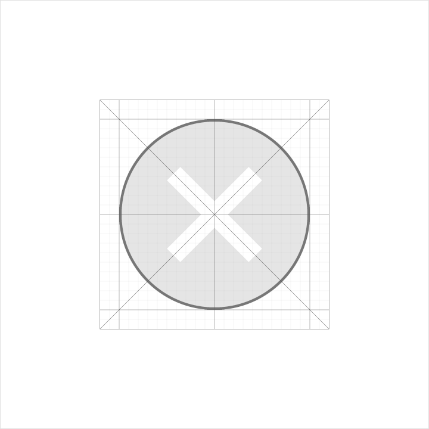
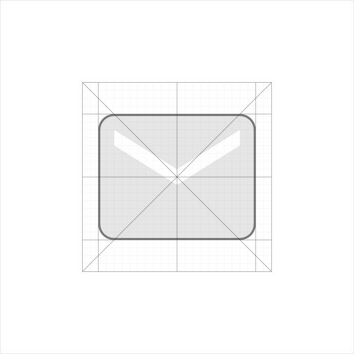
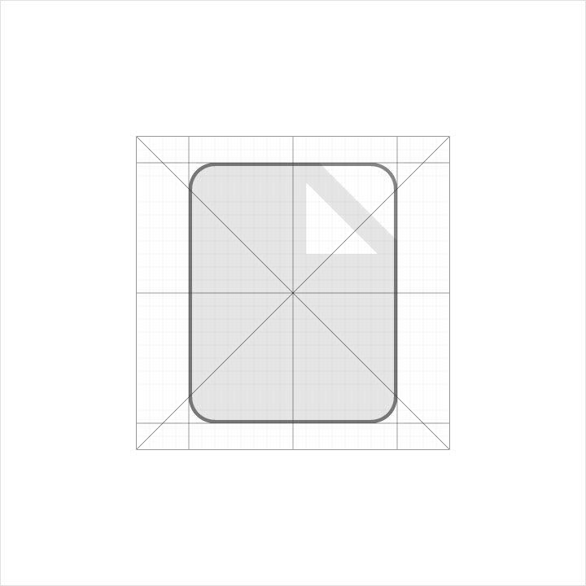
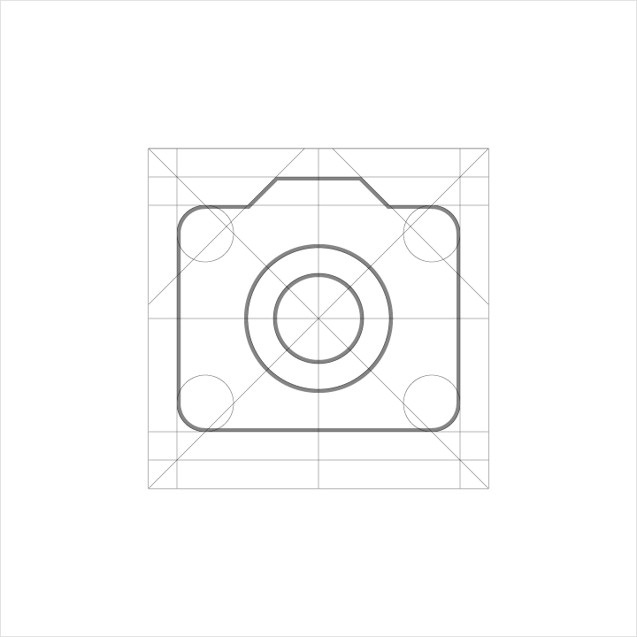
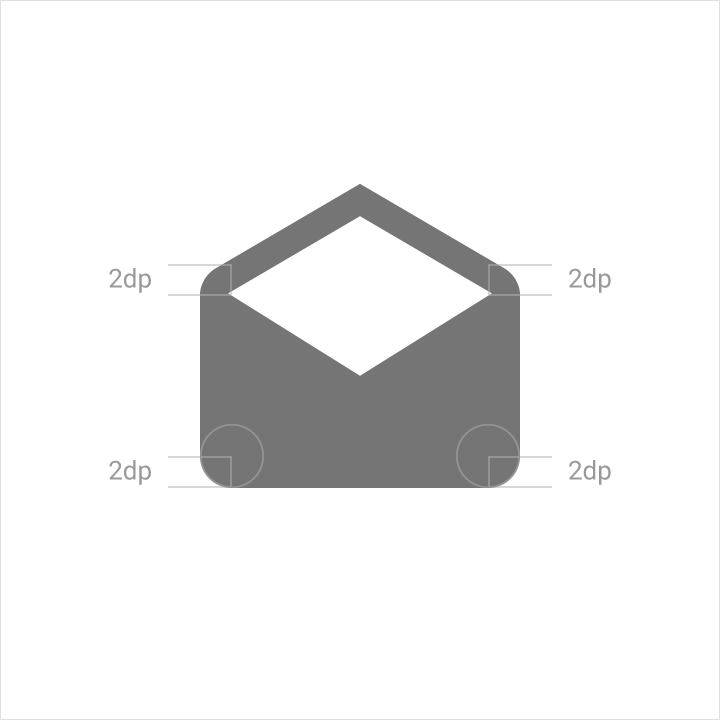

# Icons

## System Icons

### Definition

A system icon, or UI icon, symbolizes a command, file, device, or directory. System icons are also used to represent common actions like trash, print, and save.

The design of system icons is simple, modern, friendly, and sometimes quirky. Each icon is reduced to its minimal form, with every idea edited to its essence. The designs ensure readability and clarity even at small sizes.

 
### Design Principles

Shapes are bold and geometric in execution.

A play on symmetry and consistency of the shape that constructs the icon gives it a unique quality, while keeping it simple and bold.
 

 
 
### Grid, Proportion, and Size

The icon grid is a flexible grid based on key components and proportions shared by the icons. The form of the icon is constructed by flat geometric shapes that align to the grid.

Four basic geometric shapes are used in the grid, with specific sizes to ensure a consistent visual weight and proportion across all shapes.

Two sets of shapes with varying sizes are available for you to use for icons in your app: The Status Bar and Contextual Icon set and the Action Bar and Desktop icon set.
 

 

 
 
### Round Corners

Apply round corners to square and rectangular whole shapes. A play on round corner and sharp corners can be applied to square and rectangular shapes that have a protrusion or indentation. All stroked icons have sharp corners.
 

 
Each system icon size set requires a different round corner for optical consistency.

 
### Consistency

Consistency is important. Use the existing system icons whenever possible and across different apps.
 

> Do.
 

> Don't.

### Icons in Context and Application

Icons are nestled in the 24 dps bounding box determined by the grid.

