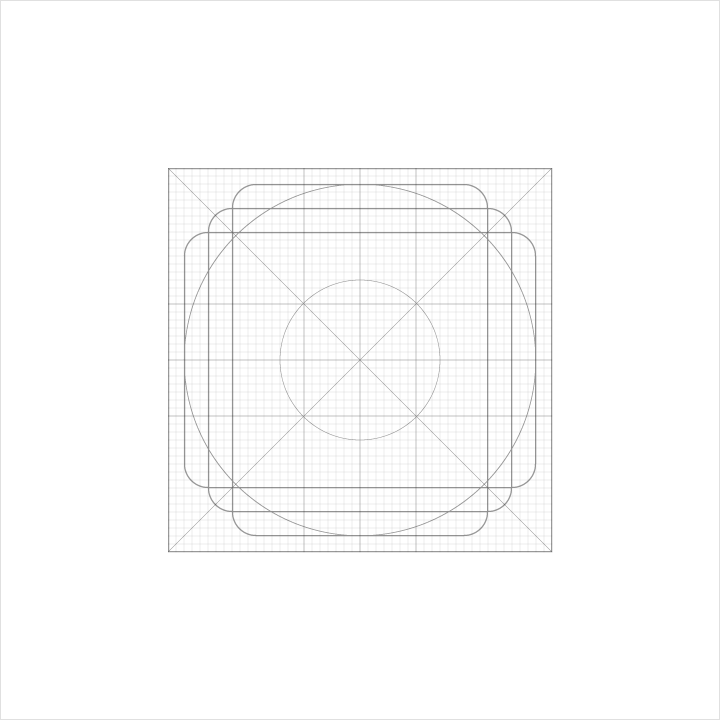
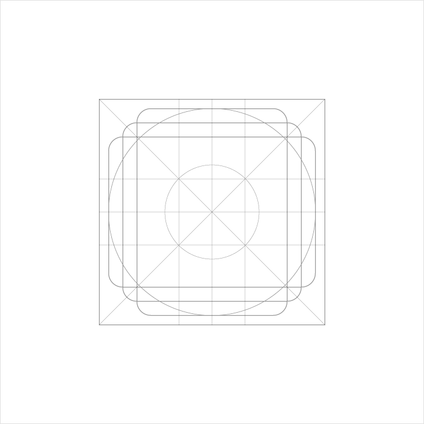
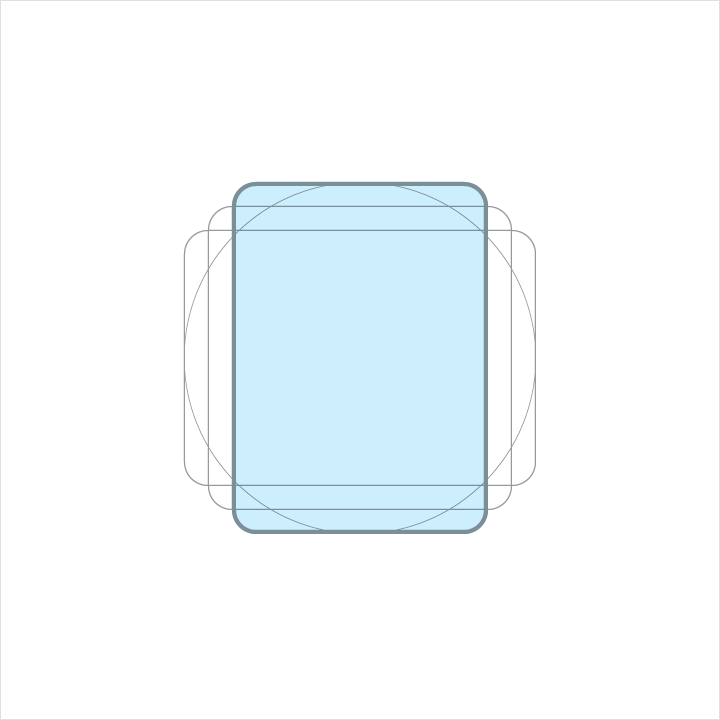
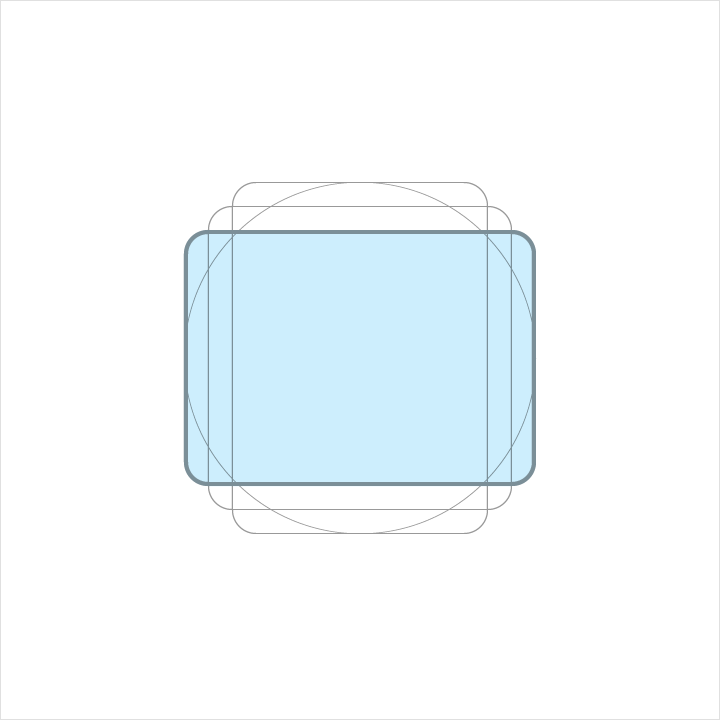
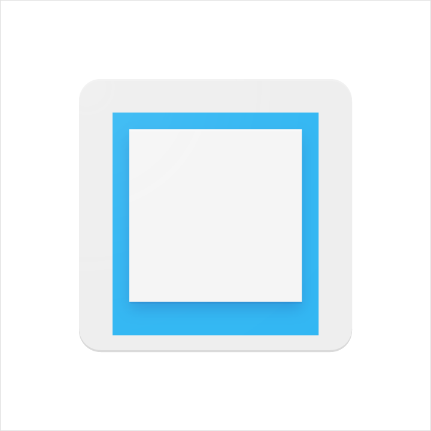

# 圖示

## 產品圖示

產品圖示是一個品牌的產品的服務和工具的視覺表達。簡單、大膽、友好的傳達產品的核心理念和意圖。雖然每個產品圖示在視覺上都不相同，但對於一個給定品牌的所有產品圖示應透過理念和執行將其統一。

產品圖示是傳達你的品牌的重要方式。使用這些準則作為出發點，確保您的產品圖示的顏色和其他關鍵要素反映你的品牌標識。

### 設計方法

產品圖示的設計靈感是由材料的觸覺和物理質量作為啟發。每個圖標都被切斷、折疊，並模擬紙張會是這樣，透過簡單的圖形元素表示。用乾淨的褶皺和清晰的邊緣使材料的質量是堅固的。磨砂般交互作用的表面與光線照射產生微妙的高光及一致的陰影。

> 物理原型

> 光影研究

> 質感原型

> 色彩研究

### 產品圖示網格

該產品的圖示網格已經發展到方便的一致性，建立一套明確的規則去定位所有的圖形元素。這種標準化導致了靈活，但連貫的系統。

> 網格

> 關鍵線條

### 關鍵線條產生的形狀

關鍵線條形狀是網格的基礎。透過使用這些核心形狀為指標，你可以保持整個相關產品的圖標一致性的視覺比例。

> **矩形**
>
> 寬高: 152

> **圓形**
> 
> 直徑: 176

> **縱向矩形**
>
> 高: 176
>
> 寬: 128
>

> **橫向矩形**
> 
> 高: 128
> 
> 寬: 176

#### DP單元格線

裝置顯示產品圖標在48dp。當您建立一個圖示，請維持在48單位的測量，但在192×192像素則放大到400％。

通過維持這單元比，可以保持鋒利的邊緣和正確的對齊，當被縮小的時候。

> 1:1 單元網格

> 4:1 單元網格

#### 幾何

預設標準已被定為特定關鍵線：圓形、正方形、長方形、直角線和對角線。這個板面裡普遍和簡單的元素已經發展到統一的產品圖示，且系統化了物件在網格上的擺放位置。

### 產品圖示剖面

產品圖示剖面介紹圖形元素是如何組成一個產品圖示。這些一致性的元素對於給定品牌的圖示是保持一個共享的視覺語言的關鍵。熟悉這些元件可以更容易地理解每個標誌和它們之間的細微差異及特徵。也將協助你的雙眼來識別標誌設計的底層結構。

1. 完成
2. Material 背景
3. Material 前景
4. 顏色
5. 陰影

> **組件**
>
> 每一個組件都定位在前一個組件雙眼直視的正上方。

> **組成透視**
>
> 分解透視案例說明每個內含組件的架構。

> **Material 背景**
> 
> 最後方的 material 元素.

> **Material 前景**
>
> 一個重疊在 Material 背景並產生陰影的元素

> **色彩斑點**
> 
> 一個用在小部分元素上的色彩

> **超出**
>
> 一個將元素從邊線到邊線填滿的色彩

> **邊緣上色**
>
> 在 Material 元素上方的邊界，是一個混和白色、比原色系更亮一些的色彩。

> **陰影般的邊緣**
>
> 在 Material 元素下方的邊界，是一個混和暗色調、比原色系更暗一些的色彩。

> **緊貼的陰影**
>
> 一個圍繞在元素邊線外圍的柔和陰影。

> **光潔的**
>
> 從左上角至右下角漸漸淡化並覆蓋所有元素，提供表面光源的柔和色彩

### 產品圖示指標

#### 光源

在 Material 的環境中，模擬燈光照亮場景，讓物體投射陰影。上方光源投射在元素上產生一個連帶陰影，在元素的頂部和底部邊緣。有角度的光增強整個表面元素的質感。

> 上方光源

> 45º 角光源

### 陰影

產品圖示上方的光源產生柔和陰影環繞整個元素，在上方跟左方示比較明亮的，陰影比較重的部分是在下方和右方，這個陰影會永遠跟圖示的外框相連。

> **下落式陰影指標**
>
> 模式: 一般
>
> 透明度: 20%
> 
> X 偏移: 0px
>
> Y 偏移: 6px
>
> 模糊: 6px
>
> 色彩: 比參考色暗一些的值

#### 著色 與 陰影邊緣

元素的頂部和底部邊緣提供深度和表面感。materiel 有一個標準1dp厚度。所有邊緣的距離都是從元素的內緣開始算起。

Tint edge 使用在所有元素的上方，左、右、下皆不使用。

Shade edge 使用在所有元素的下方，左、右、上皆不使用。

> **上色邊緣**
> 
> 高: 1dp
>
> 透明度: 20%
>
> 色彩: White (#FFFFFF)

> **陰影般的邊緣**
>
> 高: 1dp
>
> 透明度: 20%
>
> 色彩: 比參考色暗一些的值

#### 光潔

光潔的圖層是一個模擬的45度角光源，從圖示的左上延伸至右下的邊線，
光潔圖層永遠都會擺在圖示的邊框內緣。

> **漸層指標**
>
> 類型: 放射,
> 角度: 45º,
> 色彩: 白色 (#FFFFFF),
> 中心點位置: 33%
> 
> 漸變 1,
> 透明度: 10%,
> 位置: 0%
> 
> 漸變 2,
> 透明: 0%,
> 位置: 100%

#### 著色、暗處和陰影的值

當加入以上元素時每種顏色的變化不同，並非老實的加入黑或白的成分，
每個顏色必須做調整至確保看起來夠和諧以及是否為適當的對應值。

### 產品圖示模式

透過物理材料的影響，簡單制度提供表面質感和觸感。材質和色彩的相互作用產生眾多獨特的成分。

#### 色彩

色彩元素平面化至一張紙面上，不要做任何邊線及陰影的裝飾。

> 這麼做

> 別這麼做

#### 圖層

每個圖層可以加入深度及陰影。

但請不要超過兩層圖層，過多的圖層太複雜，會沒有重點。

> 這麼做

> 別這麼做

#### 狗耳般的摺角

摺邊或者狗耳，用來暗喻表格或者文件，甚至傳統紙張。

請不要將狗耳這個元素用在圖示左邊，因為產生的陰影會中斷整個圖示整體的和諧。

> 這麼做

> 別這麼做

#### 提升

提升是關鍵元素，他在背景邊線的正中央容易注視到的上方。

不要讓它被其他圖形裁切。

> 這麼做

> 別這麼做

#### 畫線

這個元素能夠在不破壞原本的形狀下產生深度的層次感，但必須在對稱圖形的中央。

請不要使用多個，或者將它放在非中心位置。

> 這麼做

> 別這麼做

#### 折

摺疊元素具有較大的維度，Spot colors 不該使用，以便避免改變或歪曲要素的本質。

> 這麼做

> 別這麼做

#### 交疊

重疊的物質元素創造出獨特的剪影。所有的元素，邊緣和陰影僅限於輪廓的內部。

不要超過兩個以上的重疊。有太多的複雜的圖標，缺乏重點。

> 這麼做

> 別這麼做

#### 手風琴

手風琴折疊元素是毗鄰且相連的對折，用於增加單一元素的尺寸。

不要超過兩個對折，太複雜的圖示沒有重點

> 這麼做

> 別這麼做

#### 扭曲

產品圖標不應該被扭曲或變形。元素應該保留原來的幾何形狀，而不被扭曲，旋轉，鞠躬，彎曲。

> 這麼做

> 別這麼做

## 系統圖示

系統圖示，或稱介面圖示，能象徵指令、檔案、裝置或目錄。系統圖示也用來表示常見的指令，例如「移至垃圾桶」、「列印」或「存檔」。

系統圖示被設計成簡潔、現代感、友善使用者甚至有時候帶點趣味感。每個圖示都將設計簡化到最精髓的樣式，這樣的設計即使在小型尺寸的圖示也能確保可讀性與清晰度。

 
### 設計原則

形態鮮明與幾何化。

對稱性與一致性維持獨特的品質，同時兼顧簡潔與鮮明。
 

> 簡單

> 直覺的

> 可操作的

> 具有一致性
 
 
### 柵格、比例與大小

#### DP單位的網格

系統圖示被顯示於24dp，當製作圖示時，它能被精準的100%縮放設計是很重要的。
 

> 100% scale

> 800% scale
 
#### 圖示網格

圖示的網格已經被發展的建立一致性，且建立清楚的規範來圖形元素的地位。這個標準是富有彈性但也具有連貫性的系統。

網格

基線

#### 內容區域

內容區域是一個圖示應該能夠存在的範圍。如果視覺比重需求，內容區域僅能延伸到修飾範圍。不要把圖標的任何部分超出修飾範圍外。

活動區域

修飾範圍

#### 基線形狀

基線形狀是網格的基礎，在使用這些核心的形狀，你可以維持整個系統圖示的一致性。

> 方形
>
> 寬與高：18px

> 圓形
>
> 半徑：20px

> 垂直矩形
>
> 高：20px, 寬：16px

> 水平矩形
>
> 高：16px, 寬：20px

#### 幾何形

預設設計的標準確定為特殊的基線：圓形、正方形、長方形、正交矩陣和對角線。這些普遍級簡單元素的小面板已經被發展為統一的Google系統圖示，並有系統的放置在圖示網格上。

建構

組成

#### 系統圖示解析

1. 筆畫終端
2. 角
3. 區域單位
4. 筆畫
5. 筆畫單位
6. 邊界區域

#### 角

一致性的圓角半徑是統一整個系統圖示的關鍵。2px的圓角用來表現圖示的輪廓。別調整圓角的筆劃(2px 的寬或是更少)

內部的角會是方形，別把內部的角調整成圓角。

> 外部角

> 內部角

#### 筆劃

一致性的筆畫寬度是統一系統圖示的關鍵。維持2px寬度的比例，包含了曲線、角、外部及內部的筆畫。

> 一致性的

> 折線及角

> 線段終點

> 筆劃單位

#### 視覺修正

在一些極端的情況來說，細微的調整能夠增加圖示的辨識度。在複雜的情況下調整細節是不可避免的。

如果視覺修正是必要的，只能用和其他圖標一致的幾何性，別用扭曲或傾斜的形式。

> 複雜

> 小縮放

#### 清空

圖示周圍保持一定的空間是需要符合易讀性和可觸控性。

> 清空區域

> 放置

#### 最佳實踐

一致性幫助使用者理解圖示。盡可能的在不同應用程式下使用已存在的系統圖示。

> 好的做法
>
> 使用相同的筆畫寬度以及方正的筆畫結尾

> 不好的做法
>
> 別使用不一致的筆畫寬度及圓角筆畫結尾

> 好的做法
>
> 讓圖示的顯示正面並且堅固

> 不好的做法
>
> 不要傾斜、旋轉，或者讓圖示表現出空間

> 好的做法
>
> 讓圖示簡化使其更有清晰度及易度性

> 不好的做法
>
> 不要過度直譯，避免複雜的圖示

> 好的做法
>
> 使圖示更加圖形化且大膽

> 不好的做法
>
> 別過度精巧，以及細的筆畫寬度

> 好的做法
>
> 使用幾何圖形，一致性的筆畫

> 不好的做法
>
> 別使用過度鬆散的形狀

> 好的做法
>
> 讓圖示在點陣上 — 意指X、Y座標數值是整數，不包含小數。
>
> 圖示需有相等的寬度和高度(Ex: 24 x 24)，避免扭曲的圖標

> 不好的做法
>
> 圖示的座標沒有再像素上。
>
> 不要有不相等的寬與高值。

#### 顏色

啟動圖示在標準的不透明度在亮色背景上是54% (#000000)。非啟動的圖示，在視覺層級上是較低的，透明度為26%(#000000)。

啟動圖示在標準的不透明度在暗色背景上是100% (#FFFFFF)。非啟動的圖示，在視覺層級上是較低的，透明度為30%(#FFFFFF)。

> *翻譯： [Peter](https://www.facebook.com/viator75)*
>
> *更新： Tillonter*
> 
> *更新：[Casper](https://www.facebook.com/chihcheng.wang.3)*

