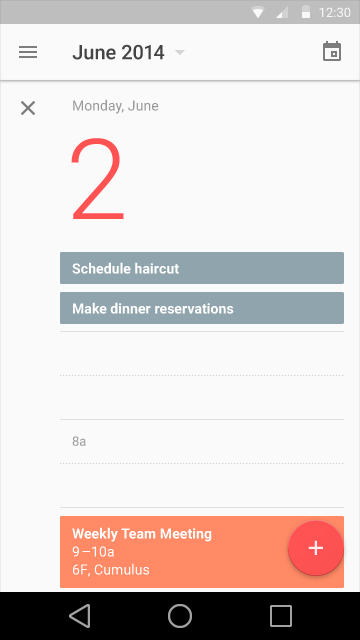
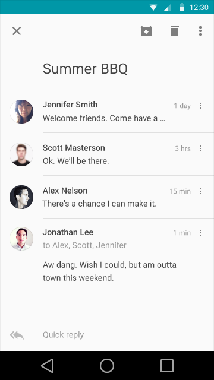
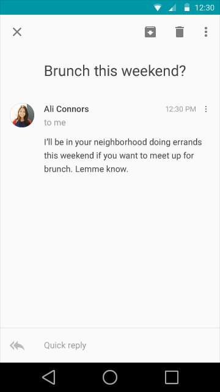
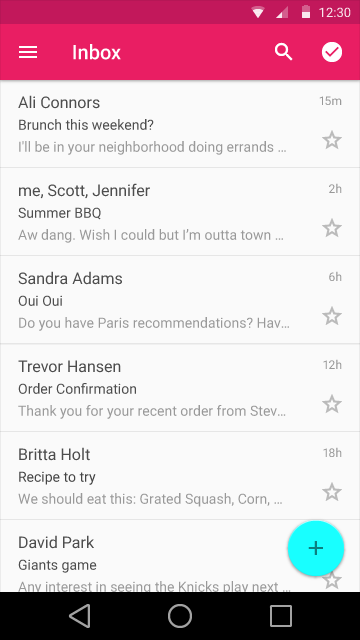

# Typography

---

## Roboto

Since the Ice Cream Sandwich release, Roboto has been the standard typeface for Android. In this version, Roboto has been refined extensively to work across the wider set of supported platforms. It is slightly wider and rounder, giving it greater clarity and making it more optimistic.

> [Roboto font](http://material-design.storage.googleapis.com/downloads/RobotoTTF.zip)

---

## Standard Styles

### Typographic Scale & Basic Styles

Too many type sizes and styles at once can wreck any layout. A typographic scale is a limited set of type sizes that work well together, along with the layout grid. The basic set of styles are based on a typographic scale of 12, 14, 16, 20, and 34.

These sizes and styles balance content density and reading comfort under typical usage conditions. Type sizes are specified with SP (scaleable pixels) to enable large-type modes for [accessibility](http://www.google.com/design/spec/usability/accessibility.html).

> Examples using Display Style

> Examples using Headline Style

Across form factors, all titles that appear in the App Bar should use the Title style.

> Examples using Title Style

There are certain scenarios where the larger Subhead style should be used instead of the smaller Body style. Some of those instances include when information is presented as small snippets or when titles are paired with lines of Body-styled text.

> Examples using Subhead style

> Examples using Body style

> Examples using Body style

> Examples using Button Style

### Basic colors/Color contrast

It makes sense that text that is the same color as the background is hard to read. What’s less obvious is that text with too much contrast can dazzle and be hard to read. This is especially true against dark backgrounds..

Text should maintain a minimum contrast ratio of at least 4.5:1 (calculated based on luminance values) for legibility. A ratio of 7:1 is preferred for comfortable reading..

These color combinations also consider contrast ratios for users with atypical color response.

### Big Type / Dynamic Type sizes

When correctly applied, big type can make apps more interesting, differentiate layouts, and help users decode content quickly.

Dynamic type sizes enable large type in cases where the length of the text in a layout is unknown. Dynamic sizes are selected from a typographic scale based on available space and letter size estimates.

Resist the urge to simply use small type to fit the worst case and to fall back on truncation as a last resort.

> Pairing examples

### Line Height

Line heights have been determined based on each style’s individual size and weight in order to achieve proper readability and appropriate spacing. Line wrapping only applies to Body, Subhead, Headline, and the smaller Display styles. All other styles should exist as single lines.
 

> Pairing examples

### Line breaking rules / Hyphenation

> Do.

> Don't.

### Characters per line lengths

Consider this advice on readability and line length from the Baymard Institute:

“You should have around 60 characters per line if you want a good reading experience. Having the right amount of characters on each line is key to the readability of your text.

"Too wide – if a line of text is too long the user’s eye will have a hard time focusing on the text. This is because the length makes it difficult to get an idea of where the line starts and ends. Furthermore it can be difficult to continue from the correct line in large blocks of text.

"Too narrow – if a line is too short the eye will have to travel back too often, breaking the reader’s rhythm. Too short lines also tend to stress people, making them begin on the next line before finishing the current one (hence skipping potentially important words).”

Source: [Readability: the Optimal Line Length](http://baymard.com/blog/line-length-readability)

### Tracking and kerning

