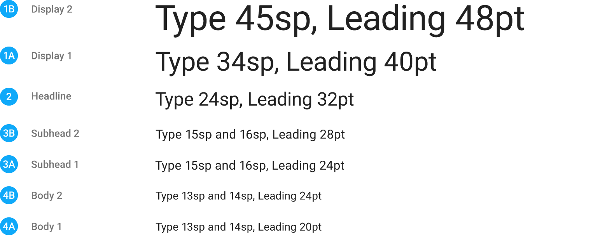
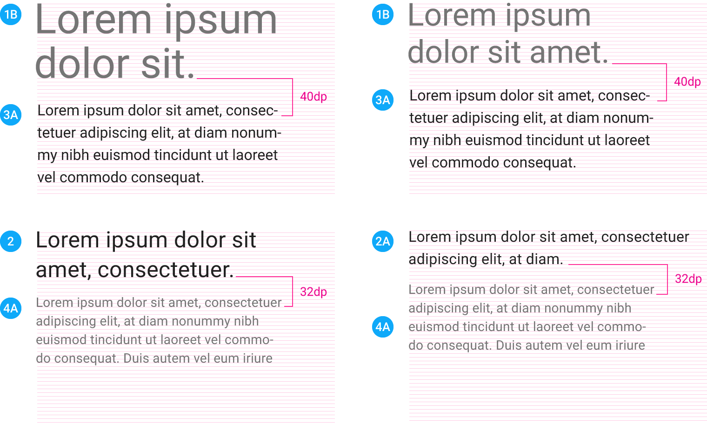
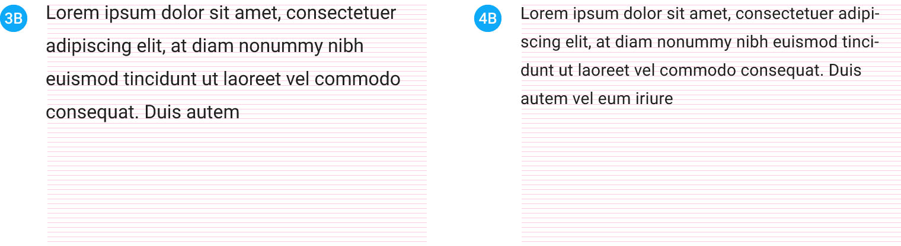
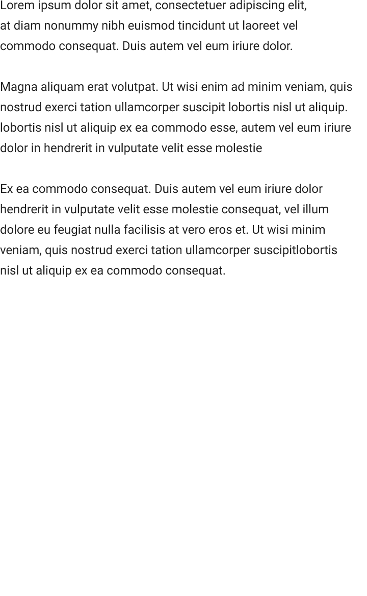
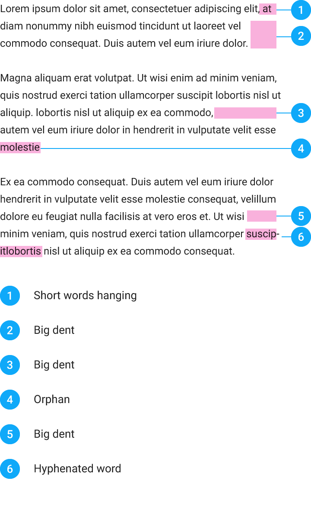
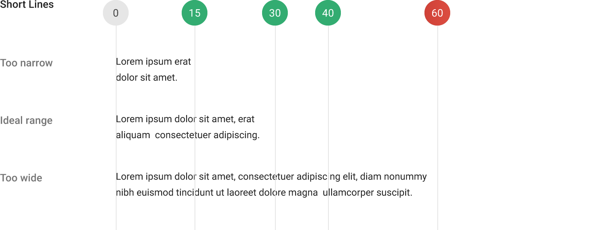

# 排版樣式

## Roboto

從Ice Cream Sandwich公開發佈消息後，Roboto一直是Android的標準字體，在這個版本中，Roboto更著重於廣泛地應用在各種不同的平台，將字體變得稍寬、稍圓了些，使它更加清晰，並使其閱讀更為舒適。Noto 也是給 Chrome OS 上所有語言的標準字體。

為了支援全世界語言，Google 建議使用 Roboto 於拉丁文、希臘文與西里爾字，以及使用 Noto 於所有其他語言。

> [Roboto font](http://material-design.storage.googleapis.com/downloads/RobotoTTF.zip)
>
> *1.21 MB (.zip)*

> [Get Noto](http://www.google.com/get/noto)
> 
> 所有語言的 Noto font family 可供下載.

Roboto 已經可以更廣泛地在各種不同的平台做應用。字體變得稍寬、稍圓，使它更加清晰，並使其閱讀更舒適。

> Roboto 的範例

> Roboto A-Z 和羅馬數字

Noto 的縱向 metrics 與 Roboto 可以並存。

> Noto Sans CJK

> Noto Sans Thai and Devanagari

### 語言覆蓋率

Roboto 對語言的支援有拉丁文、希臘文和西里爾字，像是英文、法文、希臘文和俄羅斯文。除此之外，Roboto 已經擴充到完全含括所有拉丁文、希臘文和以 Unicode 7.0 所定義的西里爾字。所支援的字元數量比先前發布的版本增加了兩倍之多，由約莫兩千增加到目前約略四千。

Noto 涵蓋所有主要現存語言，包含英文、希臘文、俄羅斯文、阿拉伯、希伯來文、中文、日文和韓文（CJK）、印度文、孟加拉文、喬治亞文、亞美尼亞文、泰文、寮文、柬埔寨文以及很多其他的。

### 字體粗細

Roboto 有六種粗細: Thin、Light、Regular、Medium、Bold 和 Black.

> Roboto 字體粗細

Noto Sans CJK 有七種粗細：Thin、Light、DemiLight、Regular、Medium、Bold 和 Black。Noto Sans CJK Regular 的粗細與 Roboto Regular的粗細相同。

> Noto Sans CJK 字體粗細

Noto fonts 提供 Regular 和 Bold，用於泰文、梵文以及所有其他主要現存語言。

> Noto 泰文和梵文的字體粗細

### 字體微調（Hinted fonts）

字體微調是字體本身的方法，為求在低分辨率顯示器看起來更好而做修改（扭曲）。作為一個折衷，一個字體的微調版會比未微調版消耗更多空間。

Roboto 和 Noto 兩者都有微調版和未微調版。Google 建議：

- 於 Android 和 Mac OS X 上使用未微調版，尚未經過調整的。
- 於 Chrome OS、Windows 和 Linux 使用微調字體。

### 字體順序（Font Stack）

對 Android 和 web 兩者，字體順序應指定為 Roboto、Noto 而後是 sans-serif。

----

## 標準樣式

排版指南提供了三種類型語言：

- **English and English-like**: 拉丁文（除了越南文）、希臘文、西里爾文、希伯來文、亞美尼亞文和喬治亞文。
- **Tall**: 語言文字需要額外的行高去適應更大的字型。包括南亞、東南亞和中東語言，例如阿拉伯文、印度文、 泰盧固語(Telugu)、泰文和越南文。
- **Dense**: 語言文字需要額外的行高去適應更大的字型但與 tall 擁有不同的 metrics。包含中文、日文和韓文。

### 文字大小與基本樣式

太多的文字尺寸與樣式可以摧毀任何一個版面，文字比例應該限制幾種大小使其在版面的隱藏格線中互相配合、對齊，基本的字體尺寸為12, 14, 16, 20, 以及 34。

**English-like**: 在文字使用的條件下，這些尺寸與樣式平衡了內文的密度以及閱讀的舒適，
文字尺寸指定伸縮像素(SP)可以使大尺寸的文字提高 [可訪問性](http://www.google.com/design/spec/usability/accessibility.html)。

**Tall**:

- 粗細: 使用 Regular，當 Noto 的 Medium 不可用。除此之外，基於母語使用者的回饋指出 Bold 過於沉重，Google 建議避免使用 Bold。
- 字體大小: Title 使用 Caption 樣式，字體大小比英語指定的大 1 像素。比標題大的樣式，英文類的字體大小是適合的。

**Dense**:

- 粗細：自從 Noto CJK 與 Roboto 一樣提供七種粗細，使用與英文相同的粗細設定。
- 字體大小：Title 使用 Caption 樣式，字體大小比英語指定的大 1 像素。比標題大的樣式，英文類的字體大小是適合的。

> 使用 Display  樣式的範例

> 使用 Headline 樣式的範例

English and English-like: 外型尺寸，文字出現在 app bar 上應使用 Title 樣式， Medium 20sp。

> 使用 Title 樣式的範例

有些時候大的 Subhead 樣式會使用較小的Body樣式來替代，
這些範例包括當資訊是介紹用途的一個小片段；
或當標題與 Body-styled 這行的文字是互相配對的時候。

> 使用 Subhead  樣式的範例

> 使用 Body  樣式的範例

> 使用 Body  樣式的範例

按鈕樣式 (Medium 14sp, 全大寫) 是應用於所有按鈕，不管他們是 ink 或 material。

> 使用 Button 樣式的範例

### 基本顏色/顏色對比

如果文字使用與背景相似的顏色，會非常難以閱讀，
使用太多高對比、奪目的顏色也會使文字不明顯，甚至難以閱讀，
尤其是針對黑色背景...

文字應該維持在4:5:1的最低限度比率對比(基於亮度值做計算)，針對易讀性，7:1的對比比率是最適合閱讀的。

這些顏色的組合都有經過對比比率的考慮，
為了非典型使用者的回應。

### 大型字/流動文字

當正當的使用情況下，大型字可以使應用程式更有趣，在不同的版面當中，能夠幫助使用者更快的理解文章傳達的內容。

流動文字的大小樣式使用在專案來說文章的長度是未知的，流動文字的字型大小取決於可用的空間以及文字間距的計算。

強烈不建議慣用小型文字去符合一個糟糕的專案，
並依靠其作為退而求其次的最後手段。

> 搭配 的範例

### 行高

行高取決於各種獨特風格的樣式以及粗細，去呈現良好的可讀性以及適當的留白。
換行只適合用在內文、條目、首行文字，還有更小的顯示樣式，
其他的樣式則應該以單行的文字顯示。
 
English and English-like: 看圖。

- **Tall**:
	用於 Body 1 和 Subhead 1，行高應大於 0.1 em 。在 English 和 English-like 文字上，行之間有明顯清楚的空白間隙。在 tall 這組，這個間隙是不夠的。對於 Body 1 和 Subhead 1，相對於英文的較小行高，缺乏空間是顯而易見的。因此，需要增加間隔確保行間隙在視覺上與 English-like 文字相似。
- 很小的 Title 行高和較大的樣式會被調整，以避免該行字元的降部緊貼於下一行字元的升部。

**Dense**:

大於 0.1 em 行高用於所有樣式。CJK ideographic characters 使用整個字體框，而英文大多使用部分字體框 － 通常低於x-高的部分。因此當設置相同高時，用於 CJK 中行與行的實際間隔將較小。為了讓 CJK 達到與英文相同設計時，行高須比用於英文時高。

> English and English-like type and leading

> Pairing examples

> Isolated examples — 增加行高

### 斷行規則/斷字

> 可行

> 不可行

### 單行字符長度

從Baymard學院我們在可讀性和行高考量了這些建議：

如果你希望有更好的閱讀體驗的話，
你應該要將每行的文字侷限在60個字以內，
控制每行文字在適當的量是良好閱讀性的最佳關鍵。

太寬 - 如果一行的文字太長，使用者必須長時間聚焦在文字上，
這是因為那樣的長度很難讓人快速領會哪邊是開頭、哪邊是結尾，
此外他可能會使在大區塊裡正確行內的文字裡連續性上變得困難。

太窄 - 如果單行文字太短，會使得使用者的眼睛必須時常來回閱讀，
打斷了閱讀的良好韻律，短行的文字也趨向壓迫閱讀者，
使他們在閱讀完重要的部分之前就開始下一段。
(因此反而跳過了隱含重要的關鍵字)

來源：[Readability: the Optimal Line Length](http://baymard.com/blog/line-length-readability)

> - 太窄
> - 理想範圍
> - 太寬

> - 太窄
> - 理想範圍
> - 太寬

### 和字距調整

> *翻譯： Tillonter*
>
> *更新： Yi-Bei*

