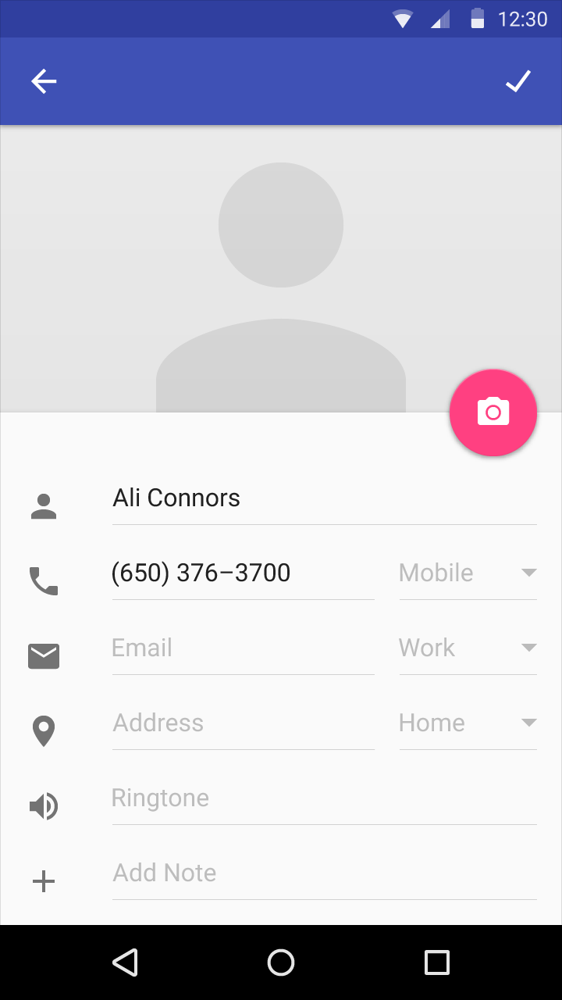
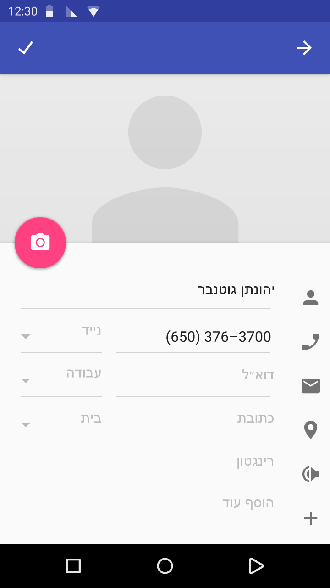

# Bidirectionality

A well-designed app supports bidirectionality, which means that it can be localized easily for language scripts that are written and read from right-to-left (RTL) or left-to-right (LTR). RTL scripts include Arabic, Hebrew, and Persian.

Bidirectionality affects not only text but also layout and iconography.

## UI mirroring overview

The main difference between RTL and LTR interfaces is the direction of time. For speakers of languages that use RTL scripts, time moves from right to left. These users expect the UI to flow from right to left to accurately reflect the direction of time.

Mirroring—changing the UI from LTR to RTL or vice-versa—includes both the layout of the app and graphical elements.
An RTL layout is the mirror image of the LTR layout. Icons are to the right of text fields. The navigation buttons are in reverse order, with the back button on the right side.

Icons that hint at a specific direction, like the speaker icon, are mirrored. Other icons, such as a camera and a check mark, remain unmirrored intentionally.

> Example using LTR UI

> Example using RTL UI

## RTL mirroring guidelines

Follow these guidelines for mirroring text, layout, and iconography to support right-to-left UIs.

The guiding principle for RTL interfaces is that time moves from right to left. Forward points to the left, backwards points to the right.

The most important icons for mirroring are back and forward buttons.

### When to mirror

Back and forward navigational buttons are reversed.

> LTR back button

> RTL back button

> LTR forward button

> RTL forward button

An icon that shows forward movement should be mirrored.

> An LTR bicycle moving forward points to the right.

> An RTL bicycle moving forward points to the left.

Other things are more subtle. For example, a icon that represents a setting uses a slash through the icon to indicate the off state. In an LTR interface, the slash goes from top left to bottom right. In an RTL interface, the slash goes from top right to bottom left.

> An LTR off state of airplane mode.

> An RTL off state of airplane mode.

Within the image, the slash is mirrored. The airplane itself points straight up. So no special treatment is needed.

A volume icon with a slider at its right side should be mirrored. The slider should progress RTL, and the sound waves should emerge from the right.

> LTR volume with slider

> RTL volume with speaker icon and slider mirrored

Icons of people, heads, or faces should typically mirror, especially if they appear close to text. This is so the people face forward, towards the text, instead of backward, shying away from the text.

This can sometimes be very subtle, as with an angled or slightly turned face, or a grouping of faces.

> LTR group icon

> RTL group icon

Sometimes, both the horizontal and circular direction of time are implied in an icon. For example, the redo and undo buttons in Google Docs have both a horizontal direction and a circular direction.

In LTR, these point to the same direction in both circular and horizontal representations of time. In RTL, choose whether to show circular or horizontal direction.

> LTR redo and undo button in docs

Icons that contain representations of text need careful mirroring.

Text is right-aligned in RTL. If there is a paragraph indent at the beginning of a paragraph, an unfinished line at the end of the paragraph, or a ragged right side, the icons need to be mirrored.

> LTR chat icon

> RTL chat icon

### When not to mirror

While the linear representation of time is mirrored in RTL, the **circular** direction of time is not. Clocks still turn clockwise for RTL languages. A clock icon or a circular refresh or progress indicator with an arrow pointing clockwise should not be mirrored.

> Refresh icon

> History icon

Some icons refer to physical objects that are not mirrored in the right-to-left world.

For example, physical keyboards look the same everywhere in the world, so they should not be mirrored.

> Keyboard icon

> Headset icon

Certain icons might seem directional but they actually represent holding an object with one’s right hand.

For example, the search icon typically has its handle at the bottom right side, because the majority of users are right-handed.

The majority of users in RTL-writing countries are also right-handed, so such icons should not be mirrored.

> Search icon

Media playback buttons and the progress indicator are not mirrored. The LTR direction of these elements represents the direction of the tape, not the direction of time.

## Other localization considerations

While considering bidirectionality in app design, think also about other factors for localized apps.

Because text in graphical elements will always require localization, try to convey concepts in ways that don’t use text.

Numbers are also text. Icons containing numbers must be localized for languages that use different numerals. For example, Bengali, Marathi, Nepali, and most Arabic locales use different forms of numbers. An icon containing these numerals would have to be redrawn to accommodate their shape.

Context matters; mirroring may be needed even for LTR locales. For example, if one is editing an RTL paragraph inside an English document in an English UI in Google Docs, the buttons for numbered and bulleted lists, and indent and unindent should be mirrored to suit RTL even though the primary UI direction is LTR.

