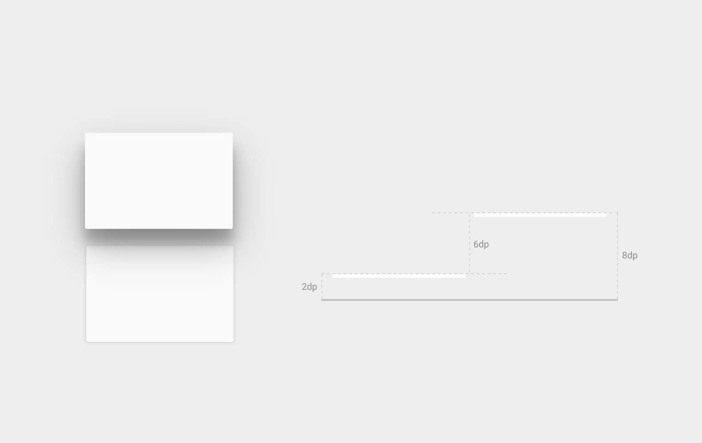
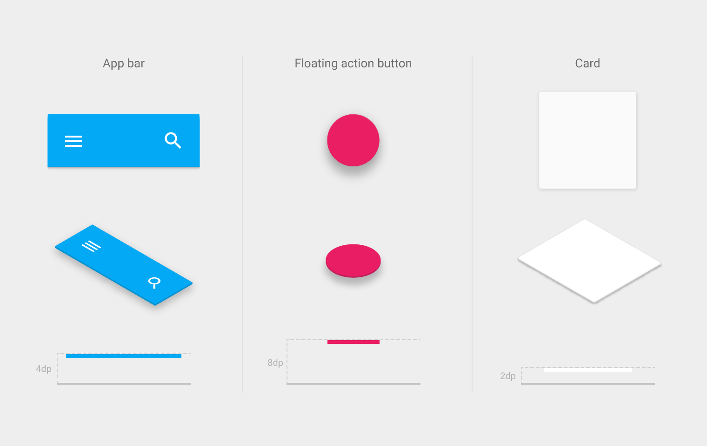
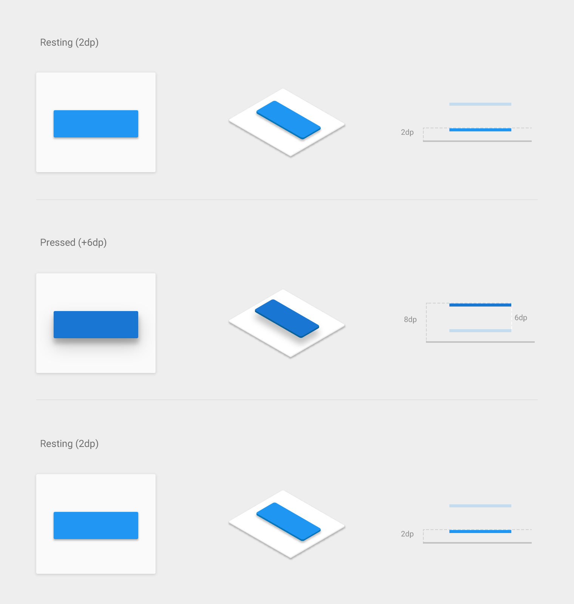
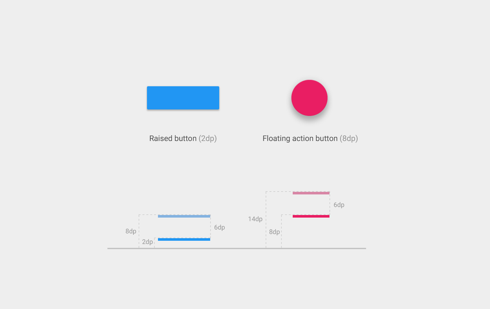
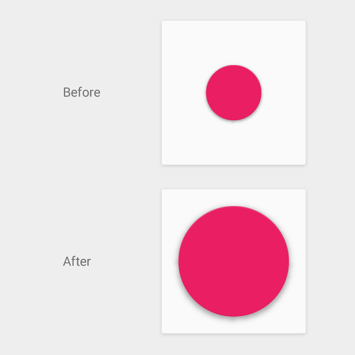

# 3D空間中的物件

在現實世界中組織物件與在material design的空間中安排物件其實是類似的。在現實世界中，物件可以堆疊或者固定在另一個物件上，但是不能穿透另一個物件。這些物件可以投射陰影與反射光線。

這些特質也適用在material design中的物件上而且協助創造一個可以一致性地使用在不同應用程式中的空間模型，而這個空間模型對用戶來說是熟悉的。

**內容**

>[高度](#elevation)
>
>[物件關係](#objectrelationships)

---

<h2 id='elevation'>高度</h2>

### 高度

高度是物件與它的parent的z軸上的相對位置。高度是parent與child間的相對數值。

高度是以x與y軸相同的單位來做衡量的，一般來說是density independent pixels (dps)。因為material有一個標準的1dp厚度，所有高度的距離是以物件最高的平面和另一個物件最高平面來做計算。

### 靜止高度

所有material物件都有一個靜止高度，不論這個物件是一個小元件或者是一個橫跨整個顯示畫面的表單。

> 典型元件靜止高度範例

在靜止狀態下，物件的靜止高度是不會改變的，這高度在整個應用程式中都是一致的。如果一個物件改變了高度，它應該儘快地回到它原來的靜止高度。

一種特定元件類型的靜止高度在一個平台中的所有應用程式都是一致的。然而同一種元件類型在不同平台中可能會有不同的靜止高度，這是取決于該環境的深度（例如：電視有比手機或桌上型電腦更大的深度）。

### 彈性的高度與動態高度偏移量

某些元件類型具有彈性的高度，也就是說它們可以依據用戶輸入或是系統事件改變高度以作為回應。不同的元件狀態（例如：正常、聚焦、按壓）也許會造成不同的高度改變，這是統一地以使用動態高度偏移量來達到這樣的效果。

動態高度偏移量是指相對于元件靜止狀態來說的，動態高度偏宜量用來做為當元件轉換成一個特定元件狀態時的目的高度。動態高度偏移量也用來確保一個元件類型當高度因為某個動作而改變時有一致的行為。舉例來說，所有元件因為點壓而提升高度時，有相對于它們目前（靜止）高度的相同高度變化。

一旦輸入事件完成或取消後，元件就會回到它的靜止高度。

### 功能性陰影

陰影提供了一些對於物件在空間中的排列方式的重要的視覺線索。陰影是表示物件表面之間分離數量的唯一視覺訊息。物件的高度決定了它的陰影在視覺上會如何呈現。

> 沒有陰影就沒有東西表示浮動按鈕按鍵是一個與背景表面互相分離的另一個表面

> 俐落的陰影表示浮動動作按鈕和應用程式橫欄非常地靠近背景表面

> 柔和的，較大的陰影表示浮動動作按鈕比應用程式橫欄處於更高的高度

在動作中，陰影也提供了關於物件的行動方向的線索。這也是一個表示物件表面之間的距離是增加或減少的工具。

> 沒有了陰影來表示高度，就無法清楚得知這個圓圈是否處於同樣的高度或者單純只是增加了它的高度。

> 當這個物件的高度增加時，陰影變得更柔和也更大，當高度減少時，陰影變得更利落也更小。

> 在這個範例中，一致的陰影幫助用戶了解這個物件只是改變形狀而沒有改變高度。

---

<h2 id='objectrelationships'>物件關係</h2>

怎麼安排物件在應用程式中決定了物件或物件組合互相之間移動的關係。物件可以獨立于彼此來移動，或者他們的行動可以被限制或依賴于它們所在的容器。容器與它們包含的物件有parent-child的關係。每個物件都有一個parent，而且也許有一個/多個child或者根本沒有child。

Child從他們的parent繼承了變形的特性，比如說位置、旋轉、大小與高度。舉例來說，在可捲動的卡片式組和中所有的卡片都一起移動，卡片們彼此是siblings，而且他們都是這個處理捲動的卡片式組合的容器的child。

Parent和child的階層架構決定了物件群組間怎麼互動。比如說，child物件和parant有最小的間距，其他的物件不能插入到parent和它的child中。

> 當parent內容捲動時，這個提高高度的按鈕（child）捲動到畫面之外。

> 這些卡片（siblings與卡片組的child）捲動到畫面之外，同時浮動動作按鈕（自己為自己的parent）留在了原地。

> *翻譯： [Sean Chen](https://www.facebook.com/shihneng.chen)*
